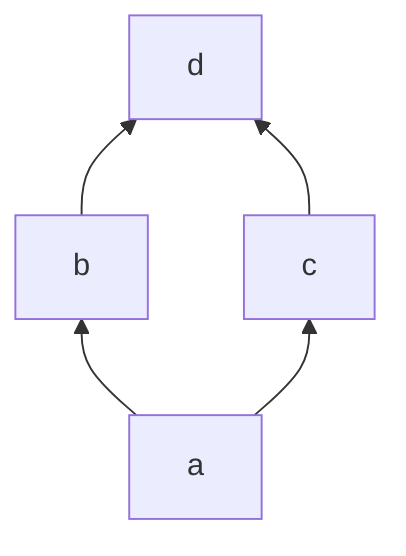
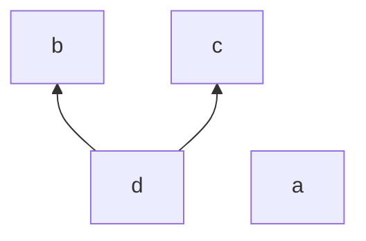
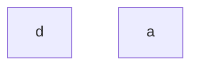
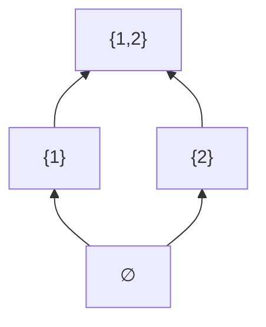
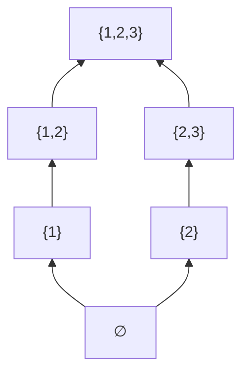
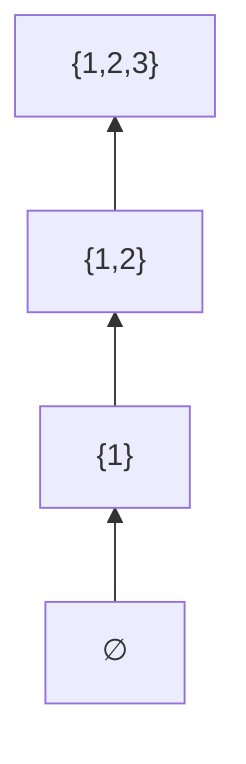

集合论是几乎所有数学分支的基础，用于研究和形式化数学对象。在本项目中，集合论被用作研究形式系统的元语言（就像学习本项目所用的元语言是简体中文），它在研究形式系统时提供了基本的工具，而不是作为研究对象本身。因此，本章将介绍集合论中最基本的内容，以满足研究形式系统的需求。 
集合论的基础性：集合论是现代数学的语言，大多数现代数学的对象都是在集合论的框架下定义的。    
研究形式系统的工具：当使用集合论来研究形式系统时，集合论本身充当了一个元语言，用于描述和操作形式系统的规则和结构。    
本章节的重点：本章的重点是介绍集合论中最基本的内容，以便学习者能够有效地应用它来研究形式系统。

---

## 2.1 集合

本小节主要介绍集合的概念及其一些基本性质。

#### **2.1.1 对象及其名称**

一、什么是对象？

在逻辑和数学中，对象（object）是指：

> 在人的感觉或思维中被确定下来的任何事物。

换句话说，凡是我们能够指认、讨论、比较或描述的“东西”，都可以称为对象。  
例如：

1. 点、线、平面、各种几何体；
2. 自然数、有理数、实数、各种数学结构；
3. 语素、格位、词、词性、句子；
4. 细胞、基因、原子、分子、电子、各种化学结构；
5. 公民、社会团体、组织、国家、政府。

这些都是我们可以谈论的“对象”。

二、对象与对象的名称

在语言中，我们不能直接“把对象放进句子里”，只能用它的名称（name）来谈论它。

例如：

> 北京是中华人民共和国的首都。

这里的“北京”是一个名称，它指代一个具体的对象——那座城市。  
这句话实际上是关于那座城市的命题。

然而，对象的名称本身也可以作为一个新的对象。  
为了区分“对象”和“表示它的名称”，我们在写作中常用引号来表示“名称”本身。例如：

> “北京”是一个名词。

如果我们写成：

> 北京是一个名词。  

就会造成混淆，因为那座城市显然不是一个名词。
总之，当我们说：“用 a 表示一个对象” ，或者说“ a 是一个对象”时，我们指的是，“a” 代表该对象的一个名称。

三、对象的相等关系

不同的名称可以指同一个对象。  
我们说两个对象 x,y **相等**（记作 x=y），是指：

> x 和 y 是同一个对象的（不同）名称。

例如：  

- “珠穆朗玛峰” 与 “埃佛勒斯峰” 指的是同一座山峰；
- “0” 与 “0.0” 表示的是同一个数；
- “圆心 O” 与 “点 O” 可以指同一个几何点。

这里，逻辑上我们假定排中律：

> 对任意两个对象 x,y，要么 x=y，要么 x≠y。

也就是说，任意两个对象之间的“相等关系”是确定的，不存在“模糊相等”或“部分相等”。

例如：

> 事实上，“晨星” = “昏星”，  

这里是说两者都是指金星（Venus）这个同一个天体。

> “晨星” ≠ “昏星”，

这里是说，晨（启明）星和昏（长庚）星分别指早上和晚上的金星，它所指的对象是不同的。 

从而，命题“晨星 = 昏星”是否为真，取决于我们所定义的对象：    

- 若我们规定“对象”指的是天体本身，则“晨星”和“昏星”都指金星这一天体，命题“晨星 = 昏星”就是真的。    
- 若我们规定“对象”指的是在不同时间可见的天文现象（即“某早晨能被观察到的星体现象”和“某傍晚被能观察星体现象”），则“晨星”和“昏星”对应的对象不同，命题“晨星 ≠ 昏星”就是真的。  

💡注意  
在逻辑学中，我们讨论命题时必须首先确定“所讨论的对象范围”，称为[**论域**](https://zh.wikipedia.org/zh-hans/%E8%AE%BA%E5%9F%9F)（domain of discourse）或**论述全集**（universe of discourse）。  
命题中出现的所有量词（如“任意”“存在”）和名称，都被理解为在这一论域之内取值。  
不同的论域会导致命题真假不同，因此在进行形式化推理前，明确论域是必要的前提。

四、复合对象

有些对象是由其他对象组成的。  
例如：

- 一条直线可以被看作是所有满足某线性方程 $ax + by = 0$ 的点的组成的；
- 一个分子是由若干个原子组成的；
- 一个社会组织由若干成员构成。

可以看出，对象既可以是基本的（原始对象），也可以是由其他对象构成的复合对象。

#### **2.1.2 集合的定义**

“集合”是数学中的一个基本概念，也就是说，它不能再用更简单的数学概念加以定义，只能通过语言来加以描述。

早在 19 世纪 70 年代，集合论的创始人康托尔（G. Cantor）就曾这样表述集合的含义：

> **集合**是具有某种性质的、确定的、互异的对象所组成的一个整体。

我们通常用大写字母 $A,B,C,X,Y,Z,$… 表示集合，  
用小写字母 $a,b,c,x,y,z,$… 表示集合中的元素。

若 $a$ 是集合 $A$ 的一个元素，则记作 $a\in A$；  
若 $a$ 不是集合 $A$ 的元素，则记作 $a\notin A$。

我们也常说：“ $a$ 属于 $A$ ” 或 “ $A$ 含有 $a$ ”。

康托尔对集合的定义中有两个关键特征：

1. **确定性**（Determinacy）  
    是指对任意集合 $A$ 及任意对象 $a$ ，要么 $a$ 是 $A$ 的元素，要么 $a$ 不是 $A$ 的元素，客观上是确定的。
    换言之，对任意集合 $A$ 及任意对象 $x$，命题 “ $x\in A$ ” 的真假是确定的。

2. **互异性**（Distinctness）  
    是指一个集合中任意两个对象是不相等的。

   例子与反例：
- 所有自然数组成的整体是一个集合。
- 所有满足“在 $n$ 与 $n+1$ 之间没有素数”的自然数 $n$ 的全体是一个集合，尽管目前我们不知道其中具体有哪些元素，但其定义条件是清晰的、确定的。
- 所有“相当大的自然数”组成的整体不是集合，因为“相当大”这一条件不确定，不满足确定性。

#### **2.1.3 集合的表示**

当一个集合 A 只含有有限多个元素时，我们可以把 A 中的所有元素全部列出来，并用花括号“{}”括起来表示这个集合。这种表示方法称为：

> **列举法**（Roster Form）  
> 又称 **外延表示法**（Extensional Form）。

例如，所有不超过 10 的自然数组成的集合可以写作： 

$A = \lbrace 0, 1, 2, 3, 4, 5, 6, 7, 8, 9, 10\rbrace$

**元素的互异性**

💡注意： $\lbrace a, a, a\rbrace$ 是否表示含有三个元素的集合呢？  
并不是。集合只关心“有哪些元素”，而不关心“元素的顺序”或“出现的次数”。一个集合中相同的元素只计一次，我们称这种要求为集合中**元素的互异性**（Distinctness）。  
因此： 

$\lbrace a, a, a\rbrace = \lbrace a\rbrace$

这个性质给集合带来了这样的一些特点：

- **重复不增元**：同样的对象在同一个集合中出现再多次也是同一元素，集合中的元素个数（我们可以称之为集合的**基数**）按集合中不同对象出现的次数计数。
- **顺序无关**： $\lbrace1,2,3\rbrace=\lbrace3,1,2\rbrace$。
- **对象本身要区分**： $1\neq\lbrace1\rbrace$。从而，集合  $\lbrace1,\lbrace1\rbrace\rbrace$  有两个彼此不同的元素。

这也是集合和其它结构的区别：

- 集合 **≠** 多重集（bag/multiset）：多重集会记录“出现次数”；集合不会。
- 集合 **≠** 序列（sequence/tuple）：序列需要关心顺序（如  $((1,2)\neq(2,1)$），而集合则不关心。

互异性告诉我们集合内部不记重复；而集合之间是否“相等”，取决于它们是否有完全相同的元素，这一点将在稍后正式通过外延公理表述。

**内涵表示法**

如果一个集合的元素太多，甚至有无穷多个元素，列举法就不再适用。  
由于集合通常由某种确定的性质 P 来刻画，我们可以用以下形式表示： 

$\lbrace\  x \mid x \text{ 具有性质 } P \ \rbrace \quad \text{或} \quad \lbrace\  x : x \text{ 具有性质 } P \ \rbrace$

这种表示方法称为：

> **描述法**（Set-builder Form）  
> 又称 **内涵表示法**（Intensional Form）。

例如：

1. 方程 $x^2 - 1 = 0$ 的所有根组成的集合：
    $A = \lbrace\  x \mid x^2 - 1 = 0 \   \rbrace$
2. 所有大于 0 且小于 1 的有理数的集合：
    $B = \lbrace\  x \mid 0 < x < 1 \text{ 且 } x \text{ 为有理数}\ \rbrace$

💡 **关注点的不同**      

> 外延表示法关注集合中**有哪些元素**；  
> 内涵表示法关注集合中元素**应满足什么条件**。  

#### **2.1.4 罗素悖论**

前面我们提到，集合是数学中的一个基本概念——它不能再用更简单的数学概念来定义，只能用语言加以描述。  
这就像在初等几何中，“点”和“直线”也是最基本的对象：

> 点：有位置而无大小；  
> 线：有长度而无宽度。

这些并非严格定义，而只是描述性说明。同样，

> “集合是具有某种性质的、确定的、互异的对象组成的全体”  
> 也是一种语言性描述，而非形式定义。

一、概括原则（Comprehension Principle）

19 世纪末，弗雷格（G. Frege）根据康托尔的思想提出了**概括原则**：

> **概括原则：**  
> 对任意确定的性质 P，所有具有性质 P 的对象组成的整体是一个集合。

形式地写作：

$A = \lbrace x \mid P(x) \rbrace$

这一原则看似自然——任何可以清楚描述的性质 P(x)，都“应该”确定一个集合。  
20 世纪初，集合论的观点和方法迅速渗透到数学的各个分支，  
集合论被视为数学的基础。然而，1902 年，罗素（B. Russell）发现这种定义方式会导致**矛盾**。

 二、悖论的产生

💡首先注意：集合本身也是**对象**。  
因此，一个集合可以成为另一个集合的元素。例如：

$\lbrace 0 \rbrace , \quad \lbrace \lbrace 0 \rbrace \rbrace$

都是集合，其中前者是后者的一个元素。

于是我们自然想到：  
集合之间也可以有“属于”关系（记作 $x \in y$）。  

特殊的性质：一个集合是否属于自身？

我们考虑一种特殊的性质：

> 集合 $x$ 不属于它自身。  
> 形式地表示为： $x \notin x$。

---

根据概括原则形成的集合

根据朴素概括原则（即：对任意性质 P，具有该性质的所有对象组成一个集合），  
我们可以设想这样一个集合： 

$T = \lbrace x \mid x \notin x \rbrace$ 

它含有所有“不属于自身的集合”。  
例如：

- 若某集合 A 满足 $A \notin A$，则 $A \in T$；
- 若某集合 B 满足 $B \in B$，则 $B \notin T$。    

现在问题来了：

> 集合 $T$ 本身是否属于自身？  
> 即， $T \in T$ 吗？

我们将看到，对这个问题的任何一种回答都会导致矛盾——这正是[ **罗素悖论**](https://zh.wikipedia.org/wiki/%E7%BD%97%E7%B4%A0%E6%82%96%E8%AE%BA)的核心。

现在问题是：

> T 是否是它自身的元素？即 $T \in T$ 吗？

我们来分别讨论两种情况：

1. 假设 T∈T  
    根据 T 的定义，集合中的每个元素都“不属于自身”。  
    因此，若 $T \in T$，就必须有 $T \notin T$。  
    ——矛盾。
2. **假设 T∉T**  
    由于 T 含有所有“不属于自身”的集合，  
    于是 T 应该属于自身： $T \in T$。  
    ——再次矛盾。

无论哪种情况，都导致自相矛盾。  
这就是**罗素悖论**（Russell’s Paradox）。

三、启示：概括原则的局限

罗素悖论说明：

> “对任意性质 $P$， $\lbrace x \mid P(x) \rbrace$ 都是集合”这一原则是有争议的。

换言之，并非所有性质都能“生成”集合。  
某些“太大”的集合（如“所有集合组成的集合”）  
在很多公理体系下不被认为是集合，而被称为**类**（class）。

稍后我们会探讨，后来的集合论体系（如 Zermelo–Fraenkel 集合论 ZF/ZFC），是如何通过限制“性质”可取的范围，从而避免这一矛盾的。  

> 💡 **注意**  
> 罗素悖论被视为现代数理逻辑的转折点。  
> 它促使数学家重新审视“集合”的定义方式，  
> 并最终催生了公理化集合论与形式逻辑体系。  
> 我们将在后续小节中正式学习ZFC公理体系如何通过**外延公理**、**分离公理**等手段绕开此类悖论。

#### **2.1.5 公理化方法**

在上一节我们看到：如果允任意性质都能收集成一个集合，就会出现罗素悖论。  这使我们能够意识到：集合的形成必须受到一定规则的限制。我们可以参考数学的其它领域，比如初等几何。

在初等几何中，“点”和“直线”被视为基本概念，也就是说，它们本身没有被严格定义，通过它们之间的基本关系（如“点 $p$ 在直线 $l$ 上”，或者说“直线 $l$ 过点 $p$”）来刻画的。尽管这些关系本身是不加定义的，被我们视作基本概念，但它们的依然理所当然的受到公理的制约。    

通俗的说，公理是在理论体系中被接受为“无需证明的真命题”。

在初等几何中，有关点与直线最重要的四个结合公理包括：

1. 过任意两点有一条直线；（存在性）
2. 过不同的两点至多有一条直线；（唯一性）
3. 每条直线上至少有两个不同的点；
4. 存在三个点不在同一条直线上。

基于这些公理，通过逻辑推导就可以得到以下这个几何定理：    

> **定理：** 两条直线相等，当且仅当存在两个不同的点，它们都在这两条直线上。

同样的思想可以用于集合论吗？

在集合论中，“集合”与“属于关系（ $\in$ ）”也被视为基本概念，  它们本身不做定义，而是由一组公理来规定其允许的行为。
特别是，在前面罗素悖论中我们已经看到：

> **朴素概括原则**会导致矛盾；  
> 因此需要用公理来**限制集合的构成方式**。

于是问题自然就产生了：

>  哪些性质可以用来构造集合？  
>  哪些“整体”是合法集合，而哪些只是“太大”的真类？ 
> 集合与属于关系必须满足哪些基本公理？

#### 2.1.6 **外延公理与空集公理**

在初等几何中，我们用“点在线上”来定义直线的相等关系：

> **两条直线相等当且仅当存在两个不同的点,它们都在这两条直线上。**

集合论中使用完全类似的思想，不过我们要把点换成元素：

🧩**外延公理**（Axiom of Extensionality）

> **两个集合相等，当且仅当它们具有完全相同的元素。**

形式化表达为：    

$A = B \ \ \Longleftrightarrow\ \  \forall x \ (x \in A \ \Longleftrightarrow\  x \in B)$

这句话的含义是：

- 如果 A 与 B 的元素完全一样 → $A = B$
- 如果它们至少在一个元素上不同 → $A \neq B$

换言之：

> **集合由其元素唯一地确定。**  
> 没有“长得一样但其实不同的集合”。

💡 **注意** 外延公理告诉我们“何时集合相等”    
📌但它**不能保证集合本身一定存在**！    

例如，外延公理没有告诉我们：  
“空空如也的集合”是不是存在？

从而，对于我们需要一个专门的存在性公理。

🧩**空集公理**（Axiom of Empty Set）

> **存在一个集合，它不含任何元素。**

符号表示：

$\exists E \, \forall x\, (x \notin E)$

也可以写成：

$\varnothing = \lbrace x \mid x \neq x \rbrace$

其中 $\varnothing$ 是**空集**符号，就是指这个不含任何元素的集合。

🌱自测题

1. 判断以下两个集合是否相等，并说明理由：  
     $\lbrace 0, 1, 2 \rbrace$ 与 $\lbrace 2, 1, 0, 2 \rbrace$ [^1]
2. 为什么不能用外延公理证明“空集存在”？ [^2]

#### **2.1.7 子集**

不妨设全体偶数所组成的整体为一个集合，记作 $\mathbb{E}$ ，并且设所有整数的整体也是集合，记作 $\mathbb{Z}$ 。那么， $\mathbb{E}$ 和 $\mathbb{Z}$ 之间有什么关系呢？容易看出， $\mathbb{E}$ 中的每个元素都是 $\mathbb{Z}$ 的元素，即 $\mathbb{Z}$ 包含 $\mathbb{E}$ 的每个元素。

我们希望用一种定义表述这种包含关系，于是有：

**定义 2.1.1** 设 A 和 B 为两个集合。称 B 是 A 的子集（Subset），如果 B 的每个元素都是 A 的元素。

我们用 $\subseteq$ 表示包含关系，即 $B \subseteq A$ 表示 B 是 A 的**子集**，读作： $B$ 包含于 $A$。如果 $B \subseteq A$ 且 $B \neq A$，则称 $B$ 是 $A$ 的**真子集**，或者称 $B$ 真包含于 $A$，记作 
$B \subset A$。

包含于的定义还可以形式化地写作：

1. $B \subseteq A$ 当且仅当对任意 $x$ ，如果 $x \in B$，则 $x \in A$。
2. $B \not\subseteq A$ 当且仅当存在 $x$ 使得 $x \in B$ 但 $x \not\in A$。

包含关系有如下基本性质：设 $A,B,C$ 为集合，则

1. $\varnothing \subseteq A$ （空集是任何集合的子集）。
2. 若对任意集合 $X$ 都有 $A\subseteq X$，则 $A=\varnothing$ （空集是唯一的“最小集合”）。
3. $A \subseteq A$ （自反性）。
4. 若 $C \subseteq B$ 且 $B \subseteq A$，则 $C \subseteq A$ （传递性）。
5. 若 $B \subseteq A$ 且 $A \subseteq B$，则 $A = B$ （自反性）。

至于这些性质到底到底意味着什么，我们会在以后的章节中细究。

💡注意区分属于和包含于

| 符号          | 意义         | 例子                              | 读法         |
| ----------- | ---------- | ------------------------------- | ---------- |
| $\in$       | **元素属于集合** | $2\in\mathbb{Z}$                | 2 属于整数集    |
| $\subseteq$ | **集合包含关系** | $\mathbb{N}\subseteq\mathbb{Z}$ | 自然数集包含于整数集 |

> “ $\in$ ” 讲的是元素和集合之间的关系  
> “ $\subseteq$ ” 讲的是两个集合之间的关系  
> 二者不可混用

#### **2.1.8 分离公理**

在前面我们提到，如果我们试图用“所有具有某种性质 P 的对象组成一个集合”来定义集合，就会遇到像罗素悖论一样的矛盾。这表明：

> **并不是任何性质都能用于“直接收集成集合”。**

因此，在许多公理化集合论（如 Zermelo–Fraenkel 集合论）中，我们不再允许从“全体对象”中直接收集，而是只允许在一个**已知集合内部**做“筛选”。

---

🧩**分离公理**（Axiom of Separation）

> 对任意性质 $P(x)$（可用逻辑的形式语言表达），以及任意集合 $A$，  
> **存在一个集合** $B$，使得：
> 
> $B = \lbrace x \in A \mid P(x) \rbrace$（或记作 $\lbrace x \mid x \in A \text{ 且 } P(x) \rbrace$ ）
> 
> 即： $B$ 的所有元素，都是 $A$ 中满足性质 $P$ 的那些对象。而由外延公理可知，分离公理中的集合 $B$ 是唯一确定的

例如：

1. 设全体整数构成的集合记为 $\mathbb{Z}$ 。  
    若定义性质 $P(x)$ 为“ $x$ 是正数”，  
    则根据分离公理，集合 $\lbrace x \in \mathbb{Z} \mid x>0 \rbrace$ 也必是一个集合，且它正是全体正整数的集合，通常记为 $\mathbb{Z}^+$ 。
2. 设全体自然数构成的集合记为 $\mathbb{N}$ 。  
    若定义性质 $P(x)$ 为“ $x$ 是偶数”，  
    则集合 $\lbrace x\in \mathbb{N} \mid x \text{ 为偶数} \rbrace$ 同样是一个集合，表示全体偶数的集合，常记为 $\mathbb{E}$ 。

这两个例子说明：

> 分离公理允许我们从一个已知存在的集合中“筛选出”满足某个性质的成员，从而得到一个新的集合。

该公理是允许我们从现有集合 “分离出”子集的公理。

💡公理要点说明

- 分离公理**不**允许我们写： $\lbrace x\mid x\text{ 是自然数}\rbrace$ ——**除非**我们已经知道“自然数”形成了一个集合。

- 它只能从“已有集合”中通过性质筛选出子集；

- 它保证每个性质 P 与每个集合 A 的组合都只产生一个确定的子集（由外延公理保证唯一性）。
  
  📘对初学者的直观总结

> 分离公理允许我们做“筛选”，但不能做“凭空创造”。

比如：

| 能做的         | 不能做的                 |
| ----------- | -------------------- |
| “从自然数中筛出偶数” | “从所有对象中筛出所有不属于自身的对象” |

（右栏的写法会导致罗素悖论类型的矛盾）

**定理 2.1.1** 设 A 为任意集合，则存在一个集合 $B$ 使得 $B \notin A$ 。

**证明** 令 $B = \lbrace x \in A \mid x \notin x \rbrace$ 由分离公理，我们可知 $B$ 是一个集合。下证 $B$ 不是 $A$ 的元素 $B \notin A$。用反证法：假设 $B \in A$，要么 $B \in B$，要么 $B\notin B$，现在我们考虑这两种可能：

1. 如果 $B \in B$，由外延公理和上面的定义可知：若 $B \in B$，且我们已假设 $B \in A$，则必有 $B \notin B$。  因此“ $B \in B$ ” 推出“ $B \notin B$ ”，与前提矛盾。
2. 如果 $B \notin B$，由外延公理和上面的定义可知：若 $B \notin B$，且我们已假设 $B \in A$，则必有 $B \in B$。  因此“ $B \notin B$ ” 推出“ $B \in B$ ”，同样矛盾。

这说明，我们假设的 $B\in A$ 不成立，故 $B\notin A$。    
 ∎

**习题 2.1.1** 证明 $\lbrace x \mid x = x \rbrace$ **不是**集合（即“所有对象组成的整体”不是集合）。

**注记 2.1.1**

严格地说，上述“分离公理”并不是单独的一条公理，而是一族公理，称为**分离公理模式**（Axiom Schema of Separation）。

原因在于，“性质 $P$”可以有许多不同的形式。例如： $x=x$， $x\notin x$， $\exists y(y\in x)$，等等。    

而对于每一种性质，都会对应一个分离命题：    
> 从已有集合 $A$ 中取出满足该性质的元素，所得对象仍是集合。

因此，严格地说，分离公理实际上是一系列公理的统称，而不是单独的一条公理。

不过在本项目中，我们暂不讨论集合论语言的形式化细节，而采用较为直观的表述。

📌 后续关联提示    
> 本节引入分离公理，是为了避免“无限制概括原则”带来的悖论。  
> 接下来，我们将继续引入其他集合构造公理，例如 **无序对公理、并集公理、幂集公理** 等，这些公理共同构成了现代集合论构造方法的基础。

#### **2.1.9 无序对和单点集**

在集合论中，我们常用花括号列举法表示含有有限多个元素的集合，例如：

- $\lbrace a, b, c, d \rbrace$ 表示“含有四个元素 $a, b, c, d$ ”的集合；
- $\lbrace a, b \rbrace$ 表示“含有两个元素 $a, b$”的集合。

然而，我们必须先回答一个更基础的问题：

> 给定任意两个对象 $a, b$，能否保证存在一个**恰好以它们为元素的集合**？

根据我们目前已经接受的三个集合论公理（外延公理、空集公理、分离公理），我们只能：

- 得到空集 $\varnothing$
- 或从已知集合中“按性质筛选”出子集

但这并不能保证：

> 当 $a, b$ 是任意对象时，集合 $\lbrace a, b \rbrace$ 一定存在。

换句话说，如果我们不能确保“把两个给定对象收集起来”也能构成集合，那么集合论就会变得非常贫乏，无法构造出许多最基本的结构。

因此，我们需要引入下面这个公理：

🧩**无序对公理**（Axiom of Pairing）：对任意两个确定的元素 $a, b$，存在一个集合，其元素有且只有 $a$ 和 $b$。

简单地讲，无序对公理是在说：设 $a$ 和 $b$ 为集合，考虑性质“ $x=a$ 或 $x=b$ ”， $\lbrace x \mid x=a \text { 或 } x=b \rbrace$ 是集合。

由于外延公理保证“元素相同的集合视为同一集合”，因此该集合是唯一的，我们记为： $\lbrace a, b \rbrace$，称为 a 和 b 的无序对（unordered pair）。

特别地，无序对公理也适用于 a=b 的情况，即它也保证： $\lbrace a, a \rbrace \text{ 是集合}$。同时，外延公理告诉我们 $\lbrace a,a \rbrace= \lbrace a \rbrace$。于是， $\lbrace a \rbrace$ 是一个以 $a$ 为其唯一元素的集合，称为**单点集**（singleton）。

**习题 2.1.2** 判断下列哪些是正确的，哪些是错误的：    
 (1) $\varnothing \subseteq \varnothing$    
 (2) $\varnothing \in \varnothing$    
 (3) $\varnothing \in \lbrace \varnothing \rbrace$    
 (4) $\varnothing \subseteq \lbrace \lbrace \varnothing \rbrace \rbrace$    
 (5) $\lbrace \varnothing \rbrace \subseteq \lbrace \lbrace \varnothing \rbrace \rbrace$    
 (6) $\lbrace \varnothing \rbrace \in \lbrace  \lbrace \varnothing \rbrace \rbrace$ 
 (7) $\lbrace \lbrace \varnothing \rbrace \rbrace \in \lbrace \varnothing \text{,} \lbrace \varnothing \rbrace \rbrace$    
 (8) $\lbrace \lbrace \varnothing \rbrace \rbrace \subseteq \lbrace \varnothing \text{,} \lbrace \varnothing \rbrace \rbrace$    
 (9) $\varnothing \in \lbrace \varnothing \text{,} \lbrace \varnothing \rbrace \rbrace$    
 (10) $\lbrace \varnothing \rbrace \in \lbrace \varnothing \text{,} \lbrace \varnothing \rbrace \rbrace$    

#### **2.1.10 交集**

假设 $A$ 和 $B$ 为两个集合。则“ $x \in A$ ”，“ $x \in B$ ”为两个性质。从而，根据分离公理知 $\lbrace x \in A \mid x \in B \rbrace$， $\lbrace x \in B \mid x \in A \rbrace$ 都是集合。再根据外延公理知，  $$\lbrace x \in A \mid x \in B \rbrace = \lbrace x \in B \mid x \in A \rbrace$$  
这个集合是是由所有既属于 A 又属于 B 的元素组成的，称作 A 与 B 的**交集**，记作 $A \cap B$。容易看出 $A \cap B = \lbrace x \mid x \in A \text { 且 } x \in B \rbrace$。

> 通俗的说，给定两个集合 $A$ 和 $B$，我们希望构造一个新的集合，它只包含那些同时属于 $A$ 和 $B$ 的元素，这就是集合的交集。

如果 $A \cap B = \varnothing$，则我们称 $A$ 和 $B$ 不交。    

**例子 2.1.1**    
设 $A = \lbrace a, b, e \rbrace \quad B = \lbrace b, c, d \rbrace \quad C = \lbrace c, e, g \rbrace \quad D = \lbrace a, b, d, f \rbrace$ 其中 $a, b, c, d, e, f, g$ 均为不同的对象。    

根据交集定义：  $x \in X \cap Y \quad \Leftrightarrow \quad x \in X \text{ 且 } x \in Y$

则：    
 $A \cap B = \lbrace b\rbrace,A \cap D = \lbrace a, b\rbrace,B \cap D = \lbrace b, d\rbrace,C \cap D = \varnothing$

**定理 2.1.2** 交集的基本性质（留作习题）

对任意集合 $A, B, C$，交集满足以下重要代数性质：

1. $A \cap A = A$ （幂等律，Idempotent law）。
2. $A \cap B = B \cap A$ （交换律，Commutative law）。
3. $A \cap (B \cap C) = (A \cap B) \cap C$ （结合律，Associative law）。
4. $A \cap B \subseteq A$， $A \cap B \subseteq B$。 
5. $B \subseteq A \Longleftrightarrow A \cap B = B$ （吸收律，Absorption law）。
6. $A \cap \varnothing = \varnothing$ 。
7. 若 $A \subseteq C,\, B \subseteq D$，则 $A \cap B \subseteq C \cap D$ （单调性，Monotonicity）。
8. 若 $C \subseteq A$ 且 $C \subseteq B$，则 $C \subseteq A \cap B$。 

**证明** 仅证结合律以示范，其余留作习题。
根据外延公理，需证 $A \cap ( B \cap C ) \subseteq ( A \cap B ) \cap C$ 且 $( A \cap  B ) \cap C  \subseteq A \cap ( B \cap C )$。    
先证 $A \cap ( B \cap C ) \subseteq ( A \cap B ) \cap C$。考虑任意 $x \in A \cap (B \cap C)$，根据交集的定义得， $x \in A \text { 且 } x \in B \cap C$，进而得 $x \in A \text { 且 } (x \in B \text { 且 } x \in C)$，由合取引入和合取消除[^3]可得 $(x \in A \text { 且 } x \in B) \text { 且 } x \in C$。故 $A \cap ( B \cap C ) \subseteq ( A \cap B ) \cap C$。    
显然， $A \cap ( B \cap C ) \subseteq ( A \cap B ) \cap C$ 的证明过程与前面的证明相仿，略去。
综上可得 $A \cap ( B \cap C ) = ( A \cap B ) \cap C$。    
 ∎    
由结合律，我们通常把 $A \cap ( B \cap C )$ 和 $( A \cap B ) \cap C$ 写作 $A \cap B \cap C$。

#### **2.1.11 并集**

设 $A$ 和 $B$ 为两个集合。考虑如下性质：

> $「x \in A \text { 或 } x \in B」$。

根据我们对对象与性质的表示方式，可以定义一个形式对象：

 $\lbrace x \mid x \in A \text{ 或 } x \in B \rbrace$

自然会问：这个对象是否是一个集合？

如果已知 $A$ 和 $B$ 都是某个集合 $E$ 的子集（即 $A \subseteq E,\, B \subseteq E$），则由分离公理，我们可以构造出集合：

 $\lbrace x \in E \mid x \in A \text{ 或 } x \in B \rbrace$

而由于两个表达式

 $\lbrace x \mid x \in A \text{ 或 } x \in B \rbrace \quad\text{和}\quad \lbrace x \in E \mid x \in A \text{ 或 } x \in B \rbrace$

恰好含有完全相同的元素，因此它们表示同一个集合。所以在这种情况下， $A$ 与 $B$ 的“并”是可以构造的。

但问题在于：

> 在目前的公理体系下，我们无法保证“必然存在一个集合 $E$ ，使得 $A\subseteq E$ 且 $B\subseteq E$” 。

因此，仅靠**外延公理 + 空集公理 + 分离公理 + 无序对公理**，我们无法证明“任意两个集合的并”一定是集合。

为此，我们引入：

🧩 **并集公理**（Axiom of Union）

> **公理：** 对任意集合 $A$ 与 $B$，由所有属于 $A$ 或属于 $B$ 的对象组成的整体，是一个集合。

记作：

 $A \cup B = \lbrace x \mid x \in A \text{ 或 } x \in B \rbrace$

换言之，对任意 $x$ 都有：
 $$x \in A \cup B \quad \Leftrightarrow \quad x \in A \text{ 或 } x \in B$$

**例子 2.1.2**    

设 $A=\lbrace a,b,e\rbrace,\quad B=\lbrace b,c,d\rbrace,\quad C=\lbrace c,e,g\rbrace,\quad D=\lbrace a,b,d,f\rbrace$

则：    
 $A \cup B = \lbrace a,b,c,d,e\rbrace, A \cup C = \lbrace a,b,c,e,g\rbrace, B \cup C = \lbrace b,c,d,e,g\rbrace, C \cup D = \lbrace a,b,c,d,e,f,g\rbrace$

**定理 2.1.3** 并集的基本性质（✏️作为习题）

设 $A, B, C, D$ 为集合，则：

1. $A \cup A = A$ （幂等律）。
2. $A \cup B = B \cup A$ （交换律）。
3. $A \cup (B \cup C) = (A \cup B) \cup C$ （结合律）。
4. $A \subseteq A \cup B , B \subseteq A \cup B$。
5. $B \subseteq A \Longleftrightarrow A \cup B = A$ （吸收律）。
6. $A \cup \varnothing = A$。
7. 若 $A \subseteq C$ 且 $B \subseteq D$，则 $A \cup B \subseteq C \cup D$ （单调性）。

**定理 2.1.4** （分配律）

设 $A, B, C, D$ 为集合，则：

1. $A \cap (B \cup C) = (A \cap B) \cup (A \cap C)$。
2. $A \cup (B \cap C) = (A \cup B) \cap (A \cup C)$。

**证明**
这里只证明第一式：
 $A \cap (B \cup C) = (A \cap B) \cup (A \cap C)$。
按照外延公理和子集的定义可知，要证上式只需证明等式两侧互为子集。      

先证 $A \cap (B \cup C) \subseteq (A \cap B) \cup (A \cap C)$ 考虑任意 x ，若 $x \in A \cap (B \cup C)$，则由交集与并集的定义得： $x \in A \ \text{且}\ (x \in B \ \text{或}\ x \in C)$，显然 $A \cap (B \cup C) \subseteq (A \cap B) \cup (A \cap C)$。    
因为有且只有两种情况：

- 若 $x \in A$ 且 $x \in B$，则 $x \in A \cap B$，因此 $x \in (A \cap B) \cup (A \cap C)$；
- 若 $x \in A$ 且 $x \in C$，则 $x \in A \cap C$，因此 $x \in (A \cap B) \cup (A \cap C)$。   

下证 $(A \cap B) \cup (A \cap C) \subseteq A \cap (B \cup C)$ 考虑任意 
$x \in (A \cap B) \cup (A \cap C)$，则根据交集和并集的定义得 $(x \in A \text { 且 } x \in B$) 或 $(x \in A \text { 且 } x \in C)$，此时可分为两种情形：

- 情形 1： $x \in A \cap B$，即 $x \in A$ 且 $x \in B$。因此由 $x \in B$ 可知 $x \in B \cup C$，从而 $x \in A \cap (B \cup C)$；
- 情形 2： $x \in A \cap C$，即 $x \in A$ 且 $x \in C$。因此由 $x \in C$ 可知 $x \in B \cup C$，从而 $x \in A \cap (B \cup C)$。
  综上可得： $x \in A \cap (B \cup C)$，故 $(A \cap B) \cup (A \cap C) \subseteq A \cap (B \cup C)$。    

综上所述， $A \cap (B \cup C) = (A \cap B) \cup (A \cap C)$。    
 ■    

第二式的证明方式类似，读者自证不难。    

#### **2.1.12 集合的差**

设 A, B 为两个集合，则由分离公理知  
${, x \in A \mid x \notin B ,}$ 也是集合。它是由所有属于 $A$ 但不属于 $B$ 的元素组成的集合，称其为 $A$ 与 $B$ 的差集，记作 $A \setminus B$。  
从而  
$x \in A \setminus B$ 当且仅当 $(x \in A$ 且 $x \notin B)$。

**例子 2.1.3**
设 $A=\lbrace 1, 2, 3, 4, 5\rbrace$， $B=\lbrace2, 3\rbrace$，则  
$A \setminus B=\lbrace 1, 4, 5\rbrace$， $B \setminus A=\varnothing$， $A \setminus A=\varnothing$。

定理 2.1.5 差集的性质（✏️作为习题）  
设 $A, B$ 为任意两个集合，则  
(1)  $A \setminus B \subseteq A$。  
(2)  $A \setminus A = \varnothing$。  
(3)  $A \setminus \varnothing = A$
(4)  $\varnothing \setminus A = \varnothing$。  
(5) $A \setminus B = A \setminus (A \cap B)$。  
(6) $A \setminus B = \varnothing$ 当且仅当 $A \subseteq B$。  
(7) $(A \setminus B) \cap (B \setminus A) = \varnothing$。  
(8)  $A \cap (B \setminus A) = \varnothing$。  
(9)  $(A \cup B) \setminus C = (A \setminus C) \cup (B \setminus C)$。  
(10)  $(A \cap B) \setminus C = (A \setminus C) \cap (B \setminus C)$。

证明 仅证 $(A \cup B) \setminus C = (A \setminus C) \cup (B \setminus C)$，其他留作习题。

先证 $(A \cup B) \setminus C \subseteq (A \setminus C) \cup (B \setminus C)$。考虑任意 $x \in (A \cup B) \setminus C$，于是 $(x \in A \text { 或 } x \in B)$ 且 $x \notin C$。并集的定义得 $x \in A$ 或 $x \in B$，并且根据差集的定义有：  
若 $x \in A$ 且 $x \notin C$，则 $x \in (A \setminus C)$；  
若 $x \in B$ 且 $x \notin C$，则 $x \in (B \setminus C)$。  
从而 $x \in (A \setminus C) \cup (B \setminus C)$。故  
$(A \cup B) \setminus C \subseteq (A \setminus C) \cup (B \setminus C)$。    

下证 $(A \setminus C) \cup (B \setminus C) \subseteq (A \cup B) \setminus C$。      
考虑任意 $x \in (A \setminus C) \cup (B \setminus C)$，根据差集和并集的定义得  
$( x \in A \text{ 且 } x \notin C ) \text{ 或 } ( x \in B \text{ 且 } x \notin C )$。
有且只有两种情形：
情形 1： 若 $x \in A$ 且 $x \notin C$，则 $x \in A \cup B$，且 $x \notin C$，从而 $x \in (A \cup B) \setminus C$。      
情形 2： 若 $x \in B$ 且 $x \notin C$，则 $x \in A \cup B$，且 $x \notin C$，从而 $x \in (A \cup B) \setminus C$。    
综上可得 $(A \setminus C) \cup (B \setminus C) \subseteq (A \cup B) \setminus C$。    

故  
$(A \cup B) \setminus C = (A \setminus C) \cup (B \setminus C)$。    
 ■   

定理 2.1.6  
设 $E, A, B$ 为任意集合，则

(1) $E \setminus (E \setminus A) =A$。  
(2) $A \subseteq B$ 当且仅当 $E \setminus B \subseteq E \setminus A$。  
(3) $E \setminus (A \cap B) = (E \setminus A) \cup (E \setminus B)$（德·摩根律）。  
(4) $E \setminus (A \cup B) = (E \setminus A) \cap (E \setminus B)$（德·摩根律）。   

**证明** 仅证 $E \setminus (A \cap B) = (E \setminus A) \cup (E \setminus B)$，其他留作习题。    

依然使用外延公理。    

先证 $E \setminus (A \cap B) \subseteq (E \setminus A) \cup (E \setminus B)$。  
考虑任意 $x \in E \setminus (A \cap B)$，则 $x \in E$ 且 $x \notin A \cap B$，于是 $x \notin A$ 或 $x \notin B$，从而 $(x \in E \text { 且 } x \notin A)$ 或 $(x \in E \text { 且 } x \notin B)$，故 $x \in (E \setminus A) \cup (E \setminus B)$。  
从而 $E \setminus (A \cap B) \subseteq (E \setminus A) \cup (E \setminus B)$。

再证 $(E \setminus A) \cup (E \setminus B) \subseteq E \setminus (A \cap B)$。  
考虑任意 $x \in (E \setminus A) \cup (E \setminus B)$，则有 $(x \in E 且 x \notin A)$ 或 $(x \in E 且 x \notin B)$。    
有且只有以下两种情形：    
情形 1：如果 $x \in E$ 且 $x \notin A$，则 $x \in E$ 且 $x \notin A \cap B$，从而 $x \in E \setminus (A \cap B)$。      
情形 2：如果 $x \in E$ 且 $x \notin B$，则 $x \in E$ 且 $x \notin A \cap B$，从而 $x \in E \setminus (A \cap B)$。    
综上得 $x \in E \setminus (A \cap B)$。故 $(E \setminus A) \cup (E \setminus B) \subseteq E \setminus (A \cap B)$。

综上根据外延公理，得 $E \setminus (A \cap B) = (E \setminus A) \cup (E \setminus B)$。    
 ■   

📌后续关联提示  
德·摩根律不仅是集合论中的运算规则，也是逻辑学和计算机科学中的基本等价式。这个定律告诉我们：“与” 与 “或” 在否定（取补）操作下会**互换**。这种规律在工程应用中有着非常深远的影响。  
- **逻辑电路设计**：与非门（NAND）、或非门（NOR）电路的等价化简依赖德·摩根律；
- **布尔代数与编程语言**：程序中的条件语句可以借此化简逻辑结构；
- **算法与可计算性**：图灵机、自动机理论中用它处理补集语言和规范转换。

**定义 2.1.2**  
设 $A, B$ 为两个集合。 $A$ 和 $B$ 的差与 $B$ 和 $A$ 的差的并集，即 $(A \setminus B) \cup (B \setminus A)$ 也是集合，称作 $A$ 和 $B$ 的**对称差**（symmetric difference），记作 $A \triangle B$。  
直观地讲， $A \triangle B$ 由所有属于 $A$ 或者属于 $B$，但不同时属于 $A$ 和 $B$ 的元素组成。

**例子 2.1.4**  
设 $A = \lbrace a, b, c \rbrace$， $B = \lbrace c, d, e \rbrace$，则 $A \setminus B = \lbrace a, b\rbrace, \quad B \setminus A = \lbrace d, e\rbrace, \quad A \triangle B = \lbrace a, b, d, e\rbrace$。    

**定理 2.1.7** 设 $A, B, C$ 为任意三个集合，则

(1) $A \triangle B = B \triangle A$（交换律）。  
(2) $A \triangle (B \triangle C) = (A \triangle B) \triangle C$（结合律）。  
(3) $A \cap (B \triangle C) = (A \cap B) \triangle (A \cap C)$（分配律）。  
(4) $A \triangle \varnothing = A$。  
(5) $A \triangle A = \varnothing$。  
(6) $A \triangle B = (A \cup B) \setminus (A \cap B)$。

（证明略去。有兴趣的读者可自行证明。）   

#### **2.1.13 幂集**

假设 $A$ 是任意给定的一个集合，那么 $A$ 的所有子集能不能组成一个集合呢？即 $\lbrace x\mid x\subseteq A\rbrace$ 是不是集合呢？如果 $A$ 只含有有穷多个元素，则我们可以证明 $\lbrace x\mid x\subseteq A\rbrace$ 是一个集合。然而，当 $A$ 不是有穷集合时，仅凭目前已经介绍的公理，我们还无法证明这个整体一定是集合。因此，我们引入一条新的公理。

🧩**幂集公理：** 对任意集合 $A$， $A$ 的所有子集组成的整体是一个集合，即 $\lbrace x\mid x\subseteq A\rbrace$ 是一个集合。
我们称 $\lbrace x\mid x\subseteq A\rbrace$ 为 $A$ 的**幂集**（power set），记作 $\mathcal P(A)$ 。于是，对任意对象 $x$， $x\in\mathcal P(A)$，当且仅当 $x\subseteq A$。    

注意： $\mathcal P(A)$ 的元素本身是集合，而不是 $A$ 的元素。
例如，若 $A=\lbrace1,2\rbrace$，则 $1\notin\mathcal P(A)$，因为 $1$ 不是集合；而 $\lbrace1\rbrace\in\mathcal P(A)$，因为 $\lbrace1\rbrace\subseteq A$。

$\mathcal P(\varnothing)=\lbrace\varnothing\rbrace,\mathcal P(\lbrace\varnothing\rbrace)=\lbrace\varnothing,\rbrace\varnothing\rbrace\rbrace,P(\lbrace0,1\rbrace)=\lbrace\varnothing,\lbrace0\rbrace,\lbrace1\rbrace,\lbrace0,1\rbrace\rbrace$    

**幂集的元素个数**
如果集合 $A$ 恰好含有 $n$ 个元素，则 $\mathcal P(A)$ 恰好含有 $2^n$ 个元素。[^4]
考虑到，设 $A={a_1,a_2,\dots,a_n}$。任取 $A$ 的一个子集 $B$。对于每个元素 $a_i$，根据排中律，要么 $a_i\in B$，要么 $a_i\notin B$。因此，构造一个子集时，对每个元素都有两种可能的选择： $a_i\in B  \qquad\text{或}\qquad  a_i\notin B.$  
反过来，如果对于每个 $a_i$ 都事先规定它是否属于 $B$，那么就唯一确定了一个子集 $B$。于是，求 $A$ 的子集个数的问题，就转化为对 $a_1,a_2,\dots,a_n$ 逐个决定“取”或“不取”的问题。由于每个元素都有两种选择，并且这些选择彼此独立，因此共有 $\underbrace{2\times2\times\cdots\times 2}_{n\text{个}}=2^n$ 种不同的选择方式。    

事实上，这个结论可以严格证明如下：设集合 $A$ 恰有 $n$ 个元素，记为 $A={a_1,a_2,\dots,a_n}$.对于任意一个子集 $B\subseteq A$，每个元素 $a_i$ 都只有两种可能：要么属于 $B$，要么不属于 $B$。因此， $B$ 完全由下面这组“是/否”选择唯一确定： $(a_1\in B \text{ 或 } a_1\notin B),(a_2\in B \text{ 或 } a_2\notin B),\dots,(a_n\in B \text{ 或 } a_n\notin B)$。     
反过来，任意给定一组这样的选择，也唯一确定了一个子集 $B$：把被选中的那些元素放入 $B$，未被选中的元素不放入 $B$。
所以，“ $A$ 的子集”与“长度为 $n$ 的二进制选择序列”之间是一一对应的。而每个位置都有两种选择，因此这样的序列共有 $\underbrace{2\times2\times\cdots\times 2}_{n\text{个}}=2^n$种。    
于是，$A$ 的子集也正好有 $2^n$ 个。每一种选择方式对应一个子集，每一个子集也对应一种选择方式。因此，如果集合 $A$ 有 $n$ 个元素，那么它的幂集有 $2^n$ 个元素。可以写作， $|\mathcal P(A)|=2^n$。   [^5]   

简单来说，对于集合 $A$ 的任意两个不同的子集，必存在某个元素在其中一个子集中而不在另一个子集中，因此它们对应的选择方式不同。反过来，每一种选择方式都唯一确定一个子集。因此， $A$ 的所有子集与上述选择方式一一对应，从而子集的个数等于选择方式的个数。    

**定理 2.1.8** 设 $A,B$ 为任意集合。    
(1) $A\subseteq B\Longrightarrow\mathcal P(A)\subseteq\mathcal P(B)$。    
(2) $\mathcal P(A)\subseteq\mathcal P(B) \Longrightarrow A\subseteq B$。    
(3) $\mathcal P(A)=\mathcal P(B)\Longleftrightarrow A=B$。
(4) $\mathcal P(A)\in\mathcal P(B)\Longrightarrow A\in B$。
(5) $\mathcal P(A)\cap\mathcal P(B)=\mathcal P(A\cap B)$。    
(6) $\mathcal P(A)\cup\mathcal P(B)\subseteq\mathcal P(A\cup B)$。    

**证明** 仅证第 (1) 个命题，其余留作习题。

假设 $A\subseteq B$ ，要证 $\mathcal P(A)\subseteq\mathcal P(B)$。考虑任意 $x\in\mathcal P(A)$ ，根据幂集公理可知 $x\subseteq A$。又因为 $A\subseteq B$，故 $x\subseteq B$，即 $x\in\mathcal P(B)$。从而 $\mathcal P(A)\subseteq\mathcal P(B)$。        
 ■    
#### **2.1.14 广义并**

我们说过，集合也是对象，因而也可以作为其他集合的元素。例如，如果 $A$ 是集合，则 $A$ 是 $\mathcal P(A)$ 的元素。

设 $A$ 为集合。考虑性质：

> “ $x$ 是 $A$ 中某个元素的元素”。

换句话说，就是 $\exists\, y\in A,\; x\in y$。那么，由所有满足这一性质的对象组成的整体 $\lbrace x\mid \exists\,y\in A,\ x\in y\rbrace$ 是不是集合呢？

为此，我们引入广义并公理。

🧩**广义并公理：**

对于任意集合 $A$，存在一个集合 $B$，使得 $B=\lbrace x\mid \exists\,y\in A,\ x\in y\rbrace$。

注意， $\lbrace x\mid \exists\,y\in A,\ x\in y\rbrace$ [^6]是由 $A$ 的所有元素的元素组成的集合，称为 $A$ 的**广义并**（union），记作 $\bigcup A$。于是，对任意对象 $x$， $x\in\bigcup A$ 当且仅当 $\exists\,y\in A,\ x\in y$。    

**例子 2.1.5**
设 $A,B,C$ 为集合，则显然有：    
(1) $\bigcup\lbrace A\rbrace=A$。    
(2) $\bigcup\lbrace A,B\rbrace=A\cup B$。    
(3) $\bigcup\lbrace A,B,C\rbrace=A\cup B\cup C$。    
(4) $\bigcup \mathcal P(A)=A$。[^7]         
(5) $\bigcup\varnothing=\varnothing$。    
(6) 如果 $A\subseteq B$，则 $\bigcup A\subseteq\bigcup B$。    

💡 注意 $\bigcup A$ 和 $\bigcup\lbrace A\rbrace$ 的区别    

#### 2.1.15 **广义交**

设 $A$ 为非空集合。考虑性质：

> “对于任意 $y\in A$，都有 $x\in y$”。

换句话说， $\forall y\in A,\; x\in y$，那么，由所有满足这一性质的对象组成的整体 $\lbrace x\mid \forall y\in A,\ x\in y\rbrace$ 是不是集合呢？

下面证明答案是肯定的。

**定理 2.1.9** 对于任意非空集合 $A$，存在集合 $B$，使得 $B=\lbrace x\mid \forall y\in A,\ x\in y\rbrace$。

**证明**

由于 $A\neq\varnothing$，可取一个元素 $a\in A$，根据分离公理可知， $\lbrace x\in a\mid \forall y\in A,\ x\in y\rbrace$[^8] 是集合，不妨记其为 $B$。    
下面说明 $B = \lbrace x\mid \forall y\in A,\ x\in y\rbrace$。    
事实上，由于 $a\in A$，若 $\forall y\in A,\ x\in y$，则特别有 $x\in a$，因此 $\forall y\in A,\ x\in y$ 与 $x\in a \quad\text{且}\quad \forall y\in A,\ x\in y$ 是等价的。故 $\lbrace x\mid \forall y\in A,\ x\in y\rbrace = \lbrace x\in a\mid \forall y\in A,\ x\in y\rbrace$。    
等号右边已经由分离公理保证是集合，因此左边也是集合。    
 ■    

由此可知， $\lbrace x\mid \forall y\in A,\ x\in y\rbrace$ 是集合。我们称其为 A 的**广义交**（intersection），记作 $\bigcap A$，于是 $x\in\bigcap A$ 当且仅当 $\forall y\in A,\ x\in y$。

**注记 2.1.2**
为什么该定理要求 $A\neq\varnothing$？    
因为证明中需要先取一个元素 $a\in A$，若 $A=\varnothing$，则无法做到这一点。
事实上，当 $A=\varnothing$ 时， $x\in\bigcap\varnothing$ 意味着 $\forall y\in\varnothing,\ x\in y$。由于空集中没有元素，因此不存在一个元素能够违反“对任意 $y\in\varnothing$，都有 $x\in y$”这一条件。所以对于任意对象 $x$，该命题都成立[^9]。
因此， $\bigcap\varnothing = \lbrace x\mid x=x\rbrace$ 也就是说，它等于所有对象组成的整体。
而我们已经证明过： $\lbrace x\mid x=x\rbrace$ 不是集合。因此，空集的广义交不是集合。这也是为什么广义交只对非空集合定义。

**例子 2.1.5**  
设 $A,B,C$ 为非空集合，则    
(1) $\bigcap\lbrace A\rbrace=A$。    
(2) $\bigcap\lbrace A,B\rbrace = A\cap B$。     
(3) $\bigcap\lbrace A,B,C\rbrace = A\cap B\cap C$。     
(4) 对于任意 $x\in A$ 都有， $\bigcap A\subseteq x$。    
(5) $\bigcap A\subseteq \bigcup A$。     
(6) 如果 $A\subseteq B$，则 $\bigcap B \subseteq \bigcap A$。    

💡 注意 $\bigcap A$ 和 $\bigcap\lbrace A\rbrace$ 的区别    
#### **2.1.16 ZFC公理系统***

#### **2.1.17 良基集合与非良基集合***

#### **2.1.18 非良基集合和循环现象***

## 2.2 关系

本小节介绍关系的基本概念、关系的运算、等价关系、各种序关系等。    

---
#### **2.2.1 有序对**    

我们知道，在平面解析几何中，一个点通常用坐标 $(x,y)$ 来表示。例如， $(1,2)$ 和 $(2,1)$，它们在平面直角坐标系上是不同位置的两个点， $(1,2)\neq(2,1)$。这给我们展现出了一个问题——我们在数学实践中常常不仅记录对象有哪些，还记录它们出现的顺序。例如，坐标（数对） $(1,2)$ 与 $(2,1)$ 含有相同的两个数（对象），但由于顺序不同，因此表示不同的对象。    

然而，在前面几节中，我们所构造的集合只能记录“有哪些元素”。例如， $\lbrace x,y\rbrace = \lbrace y,x\rbrace$。显然，集合并不关心元素的排列顺序。因此，集合本身不能直接表达“第一个对象是 $x$，第二个对象是 $y$”这样的信息。    

于是我们面临一个问题：

> 能否只利用集合的概念，构造一种既包含两个对象，又能够区分先后顺序的新对象？

我们把这样的对象称为**有序对**（ordered pair）。

在 2.1 节中我们已经知道，对于任意给定的对象 $x,y$，由无序对公理和外延公理可知 $\lbrace x\rbrace, \lbrace x,y\rbrace$ 都是集合。再次利用无序对公理，可以知道  $\bigl\lbrace\lbrace x\rbrace,\lbrace x,y\rbrace\bigr\rbrace$ 也是集合。

**有序对的定义（Kuratowski 有序对）**    

我们希望利用集合来表示“第一个对象是 x，第二个对象是 y”这样的顺序信息。为此，我们约定用 $\bigl\lbrace\lbrace x\rbrace,\lbrace x,y\rbrace\bigr\rbrace$ 来表示由 x 和 y 组成的一个有顺序的对象，并记作 $(x,y)$。也就是说， $(x,y):=\bigl\lbrace\lbrace x\rbrace,\lbrace x,y\rbrace\bigr\rbrace$。   

为什么这样定义？   

直观上， $\lbrace x,y\rbrace$ 无法体现顺序，因为 $\lbrace x,y\rbrace=\lbrace y,x\rbrace$，但在 $\bigl\lbrace\lbrace x\rbrace,\lbrace x,y\rbrace\bigr\rbrace$ 中：    

- 第一个位置的信息由单点集 $\lbrace x\rbrace$ 记录；
- 第二个位置的信息由 $\lbrace x,y\rbrace$ 记录。

这样便能够把 $x$ 和 $y$ 的顺序编码到集合结构之中。

下面的引理表明，这种定义确实能够区分两个位置上的元素，因此能够刻画我们所需要的“顺序”概念。    

**引理 2.2.1** 设 $a,b,c,d$ 为集合，则 $(a,b)=(c,d)$ 当且仅当 $a=c, b=d$。

**证明**  
设 $X=\lbrace a\rbrace, Y=\lbrace a,b\rbrace, S=\lbrace c\rbrace, T=\lbrace c,d\rbrace$。 于是 $(a,b)=\lbrace X,Y\rbrace,  (c,d)=\lbrace S,T\rbrace$。

(1) 充分性
若 $a=c,b=d,$ 则 $X=S,Y=T$。故 $\lbrace X,Y\rbrace =\lbrace S,T\rbrace$，即 $(a,b)=(c,d)$。

(2) 必要性
设 $(a,b)=(c,d)$ 即 $\lbrace X,Y\rbrace=\lbrace S,T\rbrace$。根据外延公理， $X,Y$ 与 $S,T$ 具有相同的元素。因此有两种可能：    
**情形 1** 若 $X=S,Y=T$    
由 $\lbrace a\rbrace=\lbrace c\rbrace$ 得 $a=c$，再由 $\lbrace a,b\rbrace =\lbrace c,d\rbrace$ 及 $a=c$，得 $b=d$。    
**情形 2** 若 $X=T,Y=S$        
即 $\lbrace a\rbrace=\lbrace c,d\rbrace$ 且 $\lbrace a,b\rbrace =\lbrace c\rbrace$。由于 $\lbrace a\rbrace$  只有一个元素，而 $\lbrace c,d\rbrace$ 与它相等，因此 $c=d=a$。再由 $\lbrace a,b\rbrace=\lbrace c\rbrace=\lbrace a\rbrace$ 可得 $b=a$ 于是 $a=b=c=d$。特别地， $a=c,b=d$。    

综上， $(a,b)=(c,d)$ 时，必有 $a=c,b=d$。     
 ■    

**定义 2.2.1**     
我们把 $((x_1,x_2),x_3)$ 称为 $x_1,x_2,x_3$​ 的 **3-元组**，记作 $(x_1,x_2,x_3)$。类似地，把 $((x_1,x_2,x_3),x_4)$，称为 $x_1,x_2,x_3,x_4$​ 的 **4-元组**，记作 $(x_1,x_2,x_3,x_4)$。一般地，对于 $n\ge 2$， $(x_1,x_2,\ldots,x_n)$ 定义为 $((x_1,x_2,\ldots,x_{n-1}),x_n)$，我们称其为 $x_1,x_2,\ldots,x_n$ 的 **n-元组**。[^10]    

**习题 2.2.1** 证明： $(x,y,z)=(s,t,u)$ 当且仅当 $x=s,y=t,z=u$。    

📌后续关联提示     
分量与投影：对于有序对 $(x,y)$，我们称 $x$ 为第一分量（first component）， $y$ 为第二分量（second component）。    
在某些数学文献（特别是范畴论、关系代数、数据库理论等领域）中，也把它们称为：    

- 左投影（left projection）；
- 右投影（right projection）。

即 $\pi_1(x,y)=x,\quad \pi_2(x,y)=y$。其中 $\pi_1$​ 表示取有序对的第一个元素， $\pi_2$​ 表示取有序对的第二个元素。例如， $\pi_1(1,2)=1,\quad \pi_2(1,2)=2$。    

#### **2.2.2 笛卡尔积**

给定两个集合 $A,B$。对于任意 $a\in A, b\in B$，都可以构造一个有序对 $(a,b)$。

于是我们自然会问：

> 所有满足 $a\in A$、 $b\in B$ 的有序对组成的整体是不是一个集合？

也就是说， $\lbrace (a,b)\mid a\in A,\ b\in B\rbrace$ 是不是集合？

下面证明答案是肯定的。

**定理 2.2.1** 对于任意两个集合 $A,B$， $\lbrace (a,b)\mid a\in A,\ b\in B\rbrace$ 是一个集合。称其为 $A$ 与 $B$ 的**笛卡儿积**（Cartesian product）或**卡氏积**，记作 $A\times B$。

**证明**
设 $A,B$ 为集合。由并集公理可知， $A\cup B$是集合。对于任意 $a\in A, b\in B$ 有， $\lbrace a\rbrace$ 和 $\lbrace a,b\rbrace$ 都是 $A\cup B$ 的子集。因此， $\lbrace a\rbrace ,\lbrace a,b\rbrace  \in \mathcal P(A\cup B)$。    
于是 $(a,b) = \lbrace \lbrace a\rbrace ,\lbrace a,b\rbrace \rbrace$ 是 $\mathcal P(A\cup B)$ 的一个子集。故 $(a,b) \in \mathcal P(\mathcal P(A\cup B))$。因此，任意满足 $a\in A,\ b\in B$ 的有序对 $(a,b)$ 都属于 $\mathcal P(\mathcal P(A\cup B))$。从而由外延公理可知 $\lbrace (a,b)\mid a\in A,\ b\in B\rbrace = \Bigl\lbrace  x\in\mathcal P(\mathcal P(A\cup B)) \ \Big|\ \exists a\in A,\exists b\in B\quad\text{使得}\quad x=(a,b) \Bigr\rbrace$。    
由于 $A\cup B$ 是集合，根据幂集公理， $\mathcal P(A\cup B)$ 是集合；再次应用幂集公理， $\mathcal P(\mathcal P(A\cup B))$ 也是集合。因此由分离公理可知，上式等号右侧是集合。故 $A\times B$ 也是集合。    
 ■    

因此 $A\times B = \lbrace (a,b)\mid a\in A,\ b\in B\rbrace$。 于是对任意对象 $x$， $x\in A\times B$，当且仅当 $\exists a\in A,\ \exists b\in B$ 时 $x=(a,b)$。    

**例子**
设 $A=\lbrace 1,2\rbrace ,  B=\lbrace a,b\rbrace$，则 $A\times B = \lbrace  (1,a), (1,b), (2,a), (2,b) \rbrace$。
注意： $(1,a)\neq(a,1)$。因此一般有 $A\times B \neq B\times A$。    

💡**注意**    
笛卡儿积中的元素是**有序对**，而不是集合中的普通元素。
例如， $A=\lbrace 1,2\rbrace, B=\lbrace a,b\rbrace$ 则 $(1,a)\in A\times B$ 但 $1\notin A\times B, a\notin A\times B$。因为 $A\times B$ 的元素都是形如 $(a,b)$ 的有序对。

**习题 2.2.2** 设 $A=\lbrace 1,2,3,4\rbrace , \qquad B=\lbrace 2,3,4,5\rbrace$，求 $A\times B$。    

**习题 2.2.3** 设集合 $A$ 恰含有 $n$ 个元素，集合 B 恰含有 $m$ 个元素，问 $A\times B$ 含有几个元素？        

**习题 2.2.4** 设 $A\times B = B\times A$。证明： $A=\varnothing \quad\text{或}\quad B=\varnothing \quad\text{或}\quad A=B$。   

🔍 学有余力的朋友们可以思考这样的问题：笛卡儿积的元素是有序对，因此任何由有序对组成的集合都可以看成笛卡儿积的一个子集。关系、函数以及各种代数运算是不是都可以用这种观点来描述呢？    
#### **2.2.3 二元关系**

所谓关系，即指对象之间的联系。如人与人之间的“婚姻”关系、“父子”关系。数学对象之间也有许多关系，如直线间的“平行”关系、“垂直”关系；数与数之间的“相等”关系、“大小”关系；集合间的“包含”关系；等等。我们可以用有序对的集合来表示关系。例如，“父子”关系就可表示为集合 $R=\lbrace (x,y)\mid x\text{ 是 }y\text{ 的父亲}\rbrace$。    
这个集合的意思是，对任意两个人 $x,y$，如果 $x$ 是 $y$ 的父亲，则有序对 $(x,y)$ 属于 $R$；反之，如果有序对 $(x,y)$ 属于 $R$，则表明 $x$ 是 $y$ 的父亲。    

**定义 2.2.2**（二元关系）    
如果一个集合 $R$ 中的元素都是有序对，即如果对于任意 $z\in R$ 都存在 $x,y$ 使得 $z=(x,y)$，则称 $R$ 为**二元关系**。    
通俗地讲，二元关系是有序对的集合。设 $A,B$ 为两个集合，如果 $R\subseteq A\times B$，则称 $R$ 为从 $A$ 到 $B$ 的关系。如果 $R\subseteq A\times A$，则称 $R$ 为 $A$ 上的二元关系，或者称为 $A$ 中元素间的关系。    

**例子 2.2.1** 设 $A,B$ 为两个集合。    
(1) 空集是一个关系（空关系）。    
(2) $A\times B$ 为关系（ $A$ 到 $B$ 的全关系）。
(3) $\lbrace (x,x)\mid x\in A\rbrace$ 为 $A$ 上的相等关系。    
(4) $\lbrace (X,Y)\mid X,Y\in\mathcal P(A)\text{ 且 }X\subseteq Y\rbrace$ 为 $\mathcal P(A)$ 中集合的包含关系。    
(5) 整数间的整除关系是如下集合 $\lbrace (m,n)\mid m,n\in\mathbb Z\text{ 且 }m\text{ 可整除 }n\rbrace$。    
(6) 实数集 $\mathbb R$ 上的小于关系 “ $<$ ” 实际上就是集合 $\lbrace(x,y)\mid x,y\in\mathbb R\text{ 且 }x \text{ 小于 } y\rbrace$。    

**注记 2.2.1** 对于小于关系 “ $<$ ” 而言， $x<y$ 的意思就是 $(x,y)\in <$。一般地，对于二元关系 $R$，我们常常以 $xRy$ 或 $R(x,y)$ 来表示 $(x,y)\in R$，即 $x$ 和 $y$ 有 $R$ 关系，这称为关系的**中缀表示法**（infix notation）。    
若 $xRy$，我们有时也说可以由 $x$ 沿着关系 $R$ **到达** $y$。这里的"到达（reach）"只是对关系的一种直观描述，并不意味着存在实际的运动过程，而只是表示 $(x,y)\in R$。    
因此，集合 $X$ 在关系 $R$ 下的像，就是所有能够由 $X$ 中某个元素沿着关系 $R$ 到达的元素组成的集合。    

**定义 2.2.3**（关系的定义域与值域）设 $R$ 为一个关系。    
(1) $R$ 的定义域，记作 $\mathrm{dom}(R)$，定义为 $\mathrm{dom}(R) = \lbrace x\mid \exists y,\ xRy\rbrace$。    
(2) $R$ 的值域，记作 $\mathrm{ran}(R)$，定义为 $\mathrm{ran}(R) = \lbrace y\mid \exists x,\ xRy\rbrace$。    

例如，设 $R= \lbrace (2,1),(1,2),(1,3),(2,3), (4,3),(4,1),(1,5), (5,1),(0,2),(5,0),(3,4) \rbrace$，则 $\mathrm{dom}(R) = \lbrace 2,1,4,5,0,3\rbrace\quad\mathrm{ran}(R) = \lbrace 1,2,3,5,0,4\rbrace$。    

设集合 $R$ 为二元关系，则对任意 $(x,y)\in R$ 都有 $\lbrace\lbrace x\rbrace,\lbrace x,y\rbrace\rbrace\in R$，从而 $\lbrace x\rbrace,\lbrace x,y\rbrace\in\bigcup R$。于是 $x,y\in\bigcup\bigcup R$。    

**习题 2.2.5** 证明：当 $R$ 为一个关系时， $\mathrm{dom}(R)$ 和 $\mathrm{ran}(R)$ 均为集合。    

#### **2.2.4 关系的运算**

我们知道，关系为集合。因此，可以对关系进行并、交、差等集合运算。除此之外，还有关系的逆运算、复合运算及限制等运算。    

**定义 2.2.4**
设 R 为一个关系。R 的逆关系，记作 $R^{-1}$。定义为 $R^{-1} = \lbrace (x,y)\mid (y,x)\in R\rbrace$。即对任意 $x,y$ 都有 $xR^{-1}y \iff yRx$。    

**例子 2.2.2**
$(2,1)\in R \quad\Longrightarrow\quad (1,2)\in R^{-1}$。    
若 $R= \lbrace (2,1),(1,2),(1,3),(2,3), (4,3),(4,1), (1,5),(5,1), (0,2),(5,0),(3,4) \rbrace$。则 $R^{-1} = \lbrace (1,2),(2,1),(3,1),(3,2), (3,4),(1,4), (5,1),(1,5), (2,0),(0,5),(4,3) \rbrace$。     

**引理 2.2.2** 设 $R$ 为关系。     
(1) $\mathrm{dom}(R) = \mathrm{ran}(R^{-1})$。    
(2) $\mathrm{ran}(R) = \mathrm{dom}(R^{-1})$。    
(3) $(R^{-1})^{-1}=R$。    

证明不难，留作习题。     

**定义 2.2.5**（复合关系）设 $R_1,R_2$​ 为两个关系。    
$R_1$​ 和 $R_2$​ 的复合关系，记作 $R_2\cdot R_1$。    
定义为 $R_2\cdot R_1 = \lbrace (x,y) \mid \exists z\, ((x,z)\in R_1 \land (z,y)\in R_2) \rbrace$，也可写成 $x(R_2\cdot R_1)y \iff \exists z\, (xR_1z \land zR_2y)$。    

直观上就是： $x \overset{R_1}{\longrightarrow} z \overset{R_2}{\longrightarrow} y$。    

**引理 2.2.3** 设 $R_1,R_2,R_3$​ 为关系。    
(1) $(R_3\cdot R_2)\cdot R_1 = R_3\cdot(R_2\cdot R_1)$。（结合律）    
(2) $(R_2\cdot R_1)^{-1} = R_1^{-1}\cdot R_2^{-1}$。    

**证明** 仅证结合律，把 (2) 留作习题。    
先证 $(R_3\cdot R_2)\cdot R_1 \subseteq R_3\cdot (R_2\cdot R_1)$。    
注意到二元关系中的元素都是有序对，考虑任意 $(x,y)\in (R_3\cdot R_2)\cdot R_1$。根据复合关系的定义，存在 $z$ 使得 $xR_1z \quad\text{且}\quad z(R_3\cdot R_2)y$[^11]。再根据复合关系的定义，存在 $u$ 使得 $zR_2u \quad\text{且}\quad uR_3y$。由 $xR_1z \quad\text{和}\quad zR_2u$。由此可得 $x(R_2\cdot R_1)u$。再由 $x(R_2\cdot R_1)u \quad\text{和}\quad uR_3y$。    

根据复合关系的定义可知 $x\bigl(R_3\cdot(R_2\cdot R_1)\bigr)y$，故 $(x,y)\in R_3\cdot(R_2\cdot R_1)$，从而 $(R_3\cdot R_2)\cdot R_1 \subseteq R_3\cdot(R_2\cdot R_1)$，下证 $R_3\cdot(R_2\cdot R_1) \subseteq (R_3\cdot R_2)\cdot R_1$。    

考虑任意 $(x,y)\in R_3\cdot(R_2\cdot R_1)$，根据复合关系的定义，存在 $u$ 使得 $x(R_2\cdot R_1)u \quad\text{且}\quad uR_3y$，再根据复合关系的定义，存在 $z$ 使得 $xR_1z \quad\text{且}\quad zR_2u$。由 $zR_2u \quad\text{和}\quad uR_3y$ 可得 $z(R_3\cdot R_2)y$ 再由 $xR_1z \quad\text{和}\quad z(R_3\cdot R_2)y$。根据复合关系的定义可知 $x\bigl((R_3\cdot R_2)\cdot R_1\bigr)y$，故 $(x,y)\in (R_3\cdot R_2)\cdot R_1$，从而 $R_3\cdot(R_2\cdot R_1) \subseteq (R_3\cdot R_2)\cdot R_1$。    

综上可得 $(R_3\cdot R_2)\cdot R_1 = R_3\cdot(R_2\cdot R_1)$。    

**习题 2.2.6** 举例说明： $R_2\cdot R_1 \neq R_1\cdot R_2$，即关系复合一般不满足交换律。    

**习题 2.2.7** 证明： $\mathrm{dom}(R_2\cdot R_1) \subseteq \mathrm{dom}(R_1)$， $\mathrm{ran}(R_2\cdot R_1) \subseteq \mathrm{ran}(R_2)$，并举例说明上述包含关系未必是相等关系。    

💡**注意**，这两个包含关系反映了关系复合的一个直观事实：

- 复合关系的**定义域**只能来自第一步能够出发的元素，因此不会超出 $R_1$​ 的定义域；
- 复合关系的**值域**只能来自最后一步能够到达的元素，因此不会超出 $R_2$ 的值域。

但并不是 $R_1$​ 的每一个起点都一定能够沿着 $R_2$​ 继续走下去，也不是 $R_2$ 的每一个终点都一定能够由 $R_1$​ 到达，所以一般只能得到包含关系，而不能得到相等关系。    

**习题 2.2.8**    
(1) 设 $R$ 为关系，求 $R^{-1}\cdot R$。    
(2) 设 $R$ 为自然数集 $\mathbb N$ 上的小于关系，即 $R = \lbrace (m,n)\mid m<n \rbrace$，求 $R\cdot R$。    

📌 后续关联提示    
> 本题中用到了自然数之间的大小关系以及"存在介于两个自然数之间的自然数"等性质。由于本章尚未建立自然数系统，这些性质暂作为读者熟悉的事实使用。在后续关于自然数的公理及其构造的章节中，我们将对自然数及其大小关系给出严格的集合论定义，并证明上述性质。

**定义 2.2.6**（关系的限制）
设 $R$ 为二元关系， $X$ 为集合。当 $R\!\upharpoonright X = \lbrace (x,y)\mid (x,y)\in R,\ x\in X,\ y\in X\rbrace$，称 $R\!\upharpoonright X = R\cap(X\times X)$ 为关系 $R$ 在 $X$ 上的限制。    
换言之， $R\!\upharpoonright X$ 是从关系 $R$ 中保留下来所有两个分量都属于 $X$ 的有序对所得到的新关系。    

例如：设 $R= \lbrace (2,1),(1,2),(1,3),(2,3), (4,3),(4,1), (1,5),(5,1), (0,2),(5,0),(3,4) \rbrace$ 且 $X_1=\lbrace 1,2,3\rbrace ,  X_2=\lbrace 0,2,3,5\rbrace$，则 $R\!\upharpoonright X_1 = \lbrace (1,2),(2,1), (1,3),(2,3) \rbrace$，因为这些有序对的两个分量都属于 $X_1$。又 $R\!\upharpoonright X_2 = \lbrace (0,2),(2,3),(5,0) \rbrace$，因为这些有序对的两个分量都属于 $X_2$。    

💡**注意**    
关系的限制可以理解为：**从原来的关系中，只保留满足某种条件的有序对，而舍弃其余的有序对。** 例如，只关心集合 $A$ 中元素之间的关系时，就保留两个分量都属于 $A$ 的有序对。    
从本质上看，关系的限制体现了与前面介绍的**分离公理模式**相同的思想：**先有一个已知的集合，再按照某个性质从中筛选出满足条件的元素。** 由于关系本身也是集合，因此关系的限制实际上就是从关系这个集合中筛选出满足条件的有序对。严格地说，这里的构造遵循的是分离公理模式所体现的一般方法，而不是重新引入一条新的公理。    

#### **2.2.5 像与原像**

在前面几节中，我们讨论了关系的定义、逆关系以及关系的复合。除了关心一个元素与哪些元素具有关系之外，我们还常常关心**一个集合经过关系之后会得到哪些元素**。    
例如，一个班级中的所有学生，通过"选修课程"这一关系，可以得到他们所选修的全部课程；反过来，给定若干门课程，也可以寻找所有选修这些课程的学生。    
前者称为**像（image）**，后者称为**原像（preimage）**。     

**定义 2.2.7**
设 $R$ 为二元关系， $X$ 为集合。定义 $R[X] = \lbrace \ y\mid \exists x\in X,\ xRy\ \rbrace$，称为**集合 $X$ 在关系 $R$ 下的像（image）**。也就是说， $y\in R[X]$ 当且仅当存在 $x\in X$ 使得 $xRy$。    
为了叙述方便，我们约定 $R[x] = \lbrace \ y\mid xRy\ \rbrace$，即 **单元素集合** $\lbrace x\rbrace$ 在关系 $R$ 下的像。换句话说， $R[x]=R[\lbrace x\rbrace ]$。它表示所有与元素 $x$ 具有关系 $R$ 的元素组成的集合。    
例如，若 $R=\lbrace (1,2),(1,3),(2,4)\rbrace$，则 $R[1]=\lbrace 2,3\rbrace , R[2]=\lbrace 4\rbrace , R[3]=\varnothing$。    

💡**注意**    
直观地说，求集合 $X$ 在关系 $R$ 下的像，就是把集合 $X$ 中的每一个元素都沿着关系 $R$ 向外寻找能够到达的元素，然后把得到的结果全部合并起来。    
若记 $R[x] = \lbrace\ y\mid xRy \rbrace$，则 $R[X] = \bigcup_{x\in X}R[x]$。    
也就是说，一个集合的像可以理解为**各个元素的像的广义并**。       

容易发现，关系的值域实际上是一个特殊的像。根据值域的定义， $(R) = \lbrace y\mid \exists x,\ xRy \rbrace$。而像的定义为 $R[X] = \lbrace y\mid \exists x\in X,\ xRy \rbrace$。两者唯一的区别在于：**像只考虑集合 $X$ 中的元素，而值域考虑关系定义域中的所有元素。**    
特别地，若 $X=\mathrm{dom}(R)$，则 $R[\mathrm{dom}(R)] = \mathrm{ran}(R)$。也就是说，**值域就是整个定义域在关系 $R$ 下的像。**    

**例子**    
设 $R= \lbrace  (a,1), (a,2), (b,2), (c,3) \rbrace$，则 $(R) = \lbrace a,b,c\rbrace$ ， $\mathrm{ran}(R) = \lbrace 1,2,3\rbrace$。若取 $X=\lbrace a,b\rbrace$ 则 $R[X] = \lbrace 1,2\rbrace$ 只是值域的一部分。只有当 $X=\mathrm{dom}(R)$，才有 $R[X] = \mathrm{ran}(R) = \lbrace 1,2,3\rbrace$。    

直观地说，值域表示"关系能够到达的全部元素"；而像表示"从指定集合出发能够到达的元素"。因此，像可以看作值域在不同出发集合上的局部版本。

**例子 2.2.6**    
设 $R=\lbrace (a,b),(a,c),(b,c),(c,b)\rbrace$ 且 $A=\lbrace a,b\rbrace ,  B=\lbrace b,c\rbrace$，则 $R[A] = \lbrace b,c\rbrace$ ， $R[B] = \lbrace b,c\rbrace$ ， $R[A\cup B] = \lbrace b,c\rbrace$ 。    

**定理 2.2.2**    
设 $R$ 为二元关系， $A,B\subseteq\mathrm{dom}(R)$为两个集合，则    
(1) $R[A] \subseteq R[A\cup B]$。    
(2) $R[A\cup B] = R[A]\cup R[B]$。    
(3) $R[A\cap B] \subseteq R[A]\cap R[B]$。    
**证明**    
仅证 (2) ，其他留作习题。    
根据外延公理，要证 $R[A\cup B] = R[A]\cup R[B]$，即证 $R[A] \subseteq R[A\cup B]$ 且 $R[A\cup B] \subseteq R[A]\cup R[B]$。    

由 (1) 知 $R[A] \subseteq R[A\cup B]$，以及 $R[B] \subseteq R[B\cup A] = R[A\cup B]$，故 $R[A]\cup R[B] \subseteq R[A\cup B]$。下证 $R[A\cup B] \subseteq R[A]\cup R[B]$，考虑任意 $y\in R[A\cup B]$。根据像的定义，存在 $x\in A\cup B$ 使得 $xRy$。    

分两种情形讨论。    

**情形1：**     
若 $x\in A$ 则 $y\in R[A]$，从而 $y\in R[A]\cup R[B]$。    

**情形2：**    
若 $x\in B$ 则 $y\in R[B]$，于是 $y\in R[A]\cup R[B]$。    

综上， $R[A\cup B] \subseteq R[A]\cup R[B]$。

故 $R[A\cup B] = R[A]\cup R[B]$。    
 ∎    

💡**注意**， (3) 一般不能改写成等号。原因在于，同一个像元素可以分别由集合 $A$ 和集合 $B$ 中不同的元素得到，因此即使它属于 $R[A]\cap R[B]$，
也未必来自 $A\cap B$ 中的某个元素。    

例如，设 $R=\lbrace (a,b),(a,c),(b,c),(c,b)\rbrace$ 且 $A=\lbrace a,b\rbrace ,  B=\lbrace b,c\rbrace$，则 $A\cap B=\lbrace b\rbrace$，故 $R[A\cap B] = R[\lbrace b\rbrace ] = \lbrace c\rbrace$。    
另一方面， $R[A] = R[B] = \lbrace b,c\rbrace$，于是 $R[A]\cap R[B] = \lbrace b,c\rbrace$，因此 $R[A\cap B] \neq R[A]\cap R[B]$。    

**习题 2.2.9**    
设 $R_1,R_2$ 为两个关系， $A$ 为集合，证明 $(R_2\cdot R_1)[A] = R_2[R_1[A]]$。    

**定义 2.2.8**     
设 $R$ 为二元关系， $Y$ 为集合。定义 $R^{-1}[Y] = \lbrace \ x\mid \exists y\in Y,\ xRy \rbrace$。称为**集合 $Y$ 在关系 $R$ 下的原像（preimage）**。也就是说， $x\in R^{-1}[Y]$ 当且仅当存在 $y\in Y$ 使得 $xRy$。    

💡**注意**    
直观地说，求集合 $Y$ 在关系 $R$ 下的原像，就是反过来寻找：对于集合 $Y$ 中的每一个元素，找出所有能够通过关系 $R$ 到达它的元素。    
根据逆关系的定义， $xRy \iff yR^{-1}x$。因此 $R^{-1}[Y] = (R^{-1})[Y]$。也就是说，一个集合在关系 $R$ 下的原像，就是它在逆关系 $R^{-1}$ 下的像。    
与值域是定义域的像类似，定义域也是一个特殊的原像。根据定义域的定义， $\mathrm{dom}(R) = \lbrace  x\mid \exists y,\ xRy \rbrace$。而原像的定义为 $R^{-1}[Y] = \lbrace  x\mid \exists y\in Y,\ xRy \rbrace$。    
两者唯一的区别在于：**原像只考虑集合 $Y$ 中的元素，而定义域考虑关系值域中的所有元素。**     
特别地，若 $Y=\mathrm{ran}(R)$，则 $R^{-1}[\mathrm{ran}(R)] = \mathrm{dom}(R)$。也就是说，**定义域就是整个值域在关系 $R$ 下的原像。**

**例子**    
设 $R= \lbrace  (a,1), (a,2), (b,2), (c,3) \rbrace$，则 $\mathrm{dom}(R) = \lbrace a,b,c\rbrace$  $\mathrm{ran}(R) = \lbrace 1,2,3\rbrace$。若取 $Y=\lbrace 2,3\rbrace$，则 $R^{-1}[Y] = \lbrace a,b,c\rbrace$。因为 $aR2, bR2, cR3$，若取 $Y=\lbrace 2\rbrace$，则 $R^{-1}[Y] = \lbrace a,b\rbrace$，只是定义域的一部分。只有当 $Y=\mathrm{ran}(R)$ 时，才有 $R^{-1}[Y] = \mathrm{dom}(R)$。     

从直观上来说，值域是整个定义域的像；定义域是整个值域的原像，即：    

$\boxed{ R[\mathrm{dom}(R)] = \mathrm{ran}(R), R^{-1}[\mathrm{ran}(R)] = \mathrm{dom}(R) }$      

**例子 2.2.7**    
设 $R_1 = \lbrace  (0,1), (0,2), (0,3), (1,2), (1,3), (2,3) \rbrace$ 则 $R_1^{-1}[\lbrace 2,3\rbrace ] = \lbrace 0,1,2\rbrace$。又设 $R_2 = \lbrace  (0,1), (1,0), (0,2), (2,0) \rbrace$ 则 $R_2^{-1}[\lbrace 0,1\rbrace ] = \lbrace 1,2\rbrace$。    

**习题 2.2.10** 设 $R$ 为关系，证明： $R[\varnothing]=\varnothing,\qquad R^{-1}[\varnothing]=\varnothing$。      

#### **2.2.6 等价关系**
在数学中，我们常常希望按照某种共同特征把对象进行分类。    

例如：    
- 按姓氏对人分类；
- 按照奇偶性对整数分类；
- 按照相似关系对三角形分类；
- 按照平行关系对直线分类。

这些分类都有一个共同特点：同一类中的对象彼此具有某种共同性质，而不同类之间互不混杂。    

等价关系正是描述这种"分类"思想的重要工具。     

**定义 2.2.9**    

设 $A$ 为一个集合， $R\subseteq A\times A$ 为 $A$ 上的二元关系。    

(1) 称 $R$ 为**自反关系（reflexive relation）**，如果对任意 $x\in A$

都有 $xRx$。    

(2) 称 $R$ 为**对称关系（symmetric relation）**，如果对任意 $x,y\in A$

都有， $\text{若 } xRy\text{ 则 } yRx$。    

(3) 称 $R$ 为**传递关系（transitive relation）**，如果对任意 $x,y,z\in A$

都有， $\text{ 若 }xRy\text{ 且 }\ yRz \text{ 则 } xRz$。    

(4) 若关系 $R$ 同时满足自反性、对称性和传递性，则称 $R$ 为**等价关系（equivalence relation）**。    

💡**注意**    
从直观上看：    
- 自反性表示："自己与自己等价"；
- 对称性表示："若甲与乙等价，则乙也与甲等价"；
- 传递性表示："若甲与乙等价，乙与丙等价，则甲与丙也等价"。

正是这三个性质保证了集合中的元素能够按照"彼此等价"进行分类。

**例子**      
设 $A$ 为所有中国人组成的集合， $R= \lbrace  (x,y) \mid x,y\in A \text{ 且 }x\text{ 与 }y\text{ 同姓} \rbrace$。     

则 $R$ 是 $A$ 上的等价关系。    
事实上：    
- 每个人都与自己同姓，因此满足自反性；
- 若甲与乙同姓，则乙也与甲同姓，因此满足对称性；
- 若甲与乙同姓，乙与丙同姓，则甲与丙也同姓，因此满足传递性。
因此，同姓关系是一个等价关系。    

再如，设 $\mathrm{ID}_A = \lbrace  (x,x) \mid x\in A \rbrace$，即 $A$ 上的相等关系。显然，相等关系也是等价关系。    
此外，平面中直线之间的平行关系、三角形之间的相似关系等也都是等价关系。    

**习题 2.2.11** 设 $R$ 为集合 $A$ 上的关系，证明：    
(1) $R \text{ 是自反的 } \Longleftrightarrow \mathrm{ID}_A \subseteq R$。    
(2) $R \text{ 是对称的 } \Longleftrightarrow R=R^{-1}$。    
(3) $R \text{ 是传递的 } \Longleftrightarrow R\cdot R \subseteq R$。    

💡**注意**    
关系的复合可以描述"经过一个中间元素"的关系，因此传递性可以自然地表示为 $R\cdot R \subseteq R$。也就是说，若存在某个中间元素，使得两个关系可以依次成立，那么这两个关系复合得到的关系也应当成立。    

**定义 2.2.10** 设 $R\subseteq A\times A$ 为集合 $A$ 上的等价关系。    
对于任意 $x\in A$，定义 $[x]_R = \lbrace  y\in A \mid xRy \rbrace$，称为**元素 $x$ 关于关系 $R$ 的等价类（equivalence class）**；所有等价类组成的集合 $A/R = \lbrace  [x]_R \mid x\in A \rbrace$，称为**集合 $A$ 关于关系 $R$ 的商集（quotient set）**。    

💡**注意**    
可以把等价类理解为："所有与元素 $x$ 等价的元素组成的集合。"因此，一个等价关系实际上把整个集合划分成了若干个所有与元素 $x$ 具有等价关系的元素组成的集合，我们称其为[等价类](https://zh.wikipedia.org/wiki/%E7%AD%89%E4%BB%B7%E7%B1%BB)。    

**例子**    
仍设 $R= \lbrace  (x,y) \mid x\text{ 与 }y\text{ 同姓} \rbrace$，则对于任意一个人 $x$, $[x]_R$ 就是所有与 $x$ 同姓的人组成的集合。    
例如，若 $x$ 姓王，则 $[x]_R$ 就是所有姓王的人组成的集合。    

**定理 2.2.3** 设 $R \subseteq A\times A$ 为集合 $A$ 上的等价关系。    
则：    
(1) $\forall x\in A, x\in[x]_R$，都有 $[x]_R\neq\varnothing$。    
(2) 对任意 $x,y\in A$，要么 $[x]_R=[y]_R$，要么 $[x]_R\cap[y]_R=\varnothing$。    
(3) $\bigcup(A/R)=A$。    

**证明**    
(1) 由自反性得， $xRx$。故 $x\in[x]_R$。因此 $[x]_R \neq \varnothing$。    
 ∎    

(2)    
若 $[x]_R\cap[y]_R\neq\varnothing$，则存在 $z\in[x]_R\cap[y]_R$，于是 $xRz,  yRz$。由对称性得， $zRy$；再由传递性得 $xRy$。    

下面证明 $[x]_R=[y]_R$。    
考虑任意 $u\in[x]_R$，都有 $uRx$。又因为 $xRy$，由传递性可得 $uRy$。
故 $u\in[y]_R$，因此 $[x]_R \subseteq [y]_R$。同理可证， $[y]_R \subseteq [x]_R$。于是根据外延公理可知 $[x]_R=[y]_R$。    
因此，不同等价类只能互不相交。    
 ∎    

(3)    
由 (1) 知，每个元素 $x\in A$ 都属于自己的等价类 $[x]_R$。因此， $A \subseteq \bigcup(A/R)$。另一方面，每个等价类都是 $A$ 的子集。因此， $\bigcup(A/R) \subseteq A$。故 $\bigcup(A/R)=A$。     
 ∎    

💡**注意**    
定理 2.2.3 表明，每个元素都属于且只属于一个等价类。因此，等价类把整个集合划分成了若干互不重叠的部分。这正是我们最初希望实现的"分类"。    

**定义 2.2.11** 设 $A$ 为集合， $\Sigma \subseteq \mathcal P(A)\setminus\lbrace \varnothing\rbrace$。称 $\Sigma$ 为集合 $A$ 的**分划（partition）**，如果满足：    
(1) $\bigcup\Sigma=A$。     
(2) 对于任意 $X,Y\in\Sigma$，若 $X\neq Y$，则 $X\cap Y=\varnothing$。    

**例子**
设 $A= \lbrace 0,1,2,3,4,5,6,7,8,9\rbrace$，令 $X_1=\lbrace 0,3,6,9\rbrace$ $X_2=\lbrace 1,4,7\rbrace$  $X_3=\lbrace 2,5,8\rbrace$，则 $\Sigma = \lbrace X_1,X_2,X_3\rbrace$ 是集合 $A$ 的一个分划。

💡**注意**    
前面的定理已经说明，一个等价关系会把集合划分成若干互不相交的等价类。于是自然产生了"分划"这一概念，它抽象出了"把集合分成若干部分"这一思想。    
由定理 2.2.3 可知，若 $R$ 是 $A$ 上的等价关系，则 $A/R$ 是 $A$ 的一个分划。    
下面的定理说明，反过来也成立。    

**定理 2.2.4**
设 $\Sigma$ 为集合 $A$ 的一个分划，则存在 $A$ 上的等价关系 $R$，使得
 $A/R = \Sigma$。    
**证明**    
定义 $R = \lbrace  (x,y) \mid \exists X\in\Sigma,\ x,y\in X \rbrace$，即规定：当且仅当两个元素属于分划中的同一个部分时，它们彼此等价。    
容易验证：    
- $R$ 满足自反性；
- $R$ 满足对称性；
- $R$ 满足传递性。
因此， $R$ 是 $A$ 上的等价关系。     

进一步可以验证：对于任意 $X\in\Sigma$ 它恰好就是某个元素的等价类。因此， $A/R = \Sigma$。    
 ∎    

📌 后续关联提示
等价关系最大的作用，就是按照"彼此等价"这一标准把集合划分成若干类别。    
每个元素恰好属于一个等价类，不同等价类互不相交，而所有等价类的并集恰好是整个集合。因此，研究等价关系与研究集合的分划，可以看作是在研究同一种数学结构，只是观察的角度不同：    
- **等价关系**强调"什么元素彼此等价"；
- **等价类**强调"每一个元素属于哪一类"；
- **分划**强调"整个集合被分成了哪些部分"。

这种思路对于读者后续学习商集、商结构以及各种代数结构时将会有帮助。    

#### **2.2.7 偏序关系**

在日常生活中，我们经常会比较两个对象之间的关系。
例如：    
- 一个集合是否包含于另一个集合；
- 一个文件夹是否包含另一个文件夹；
- 一个课程是否**必须**比另一个课程先学习；
- 一个任务是否**必须**在另一个任务之前完成。    

不难发现，上述这些关系都有一个共同特点：它们能够反映某种"先后"、"大小"或"包含"意义，但并不一定要求任意两个对象都能够像自然数的大小关系那样能够比较。例如，设 $A=\lbrace 1\rbrace, B=\lbrace 2\rbrace$，由于 $A\nsubseteq B \text{ 且 } B\nsubseteq A$，因此这两个集合不能通过包含关系来比较。    
为了刻画这种"可以比较，但不一定处处都能比较"的情形，我们不妨引入一种关系——**偏序**（partial order）。  

**定义 2.2.12**（偏序关系） 设 $A$ 为一个集合， $R\subseteq A\times A$为 $A$ 上的二元关系。称 $R$ 为 $A$ 上的**偏序关系**，如果满足：    
(1) **自反性** 对于任意 $x\in A$，都有 $xRx$。    
(2) **反对称性** 对于任意 $x,y\in A$，如果 $xRy \text{ 且 } yRx$，则 $x=y$。    
(3) **传递性** 对于任意 $x,y,z\in A$，如果 $xRy \text{ 且 } yRz$，则 $xRz$。    

为了更好的解释偏序关系，我们先约定一种说法。    
> 若元素 $x$ 与元素 $y$ 满足偏序关系 $xRy$，且 $x\neq y$，我们称 $x$ 在偏序关系上**偏序于** $y$，记作 $\preceq$。    

💡**注意**    
 偏序中的"序"，可以理解为一种"位置关系"，而不是通常意义上的大小。    

例如：    
- 在包含关系中，可以理解为"谁包含谁"；
- 在文件夹关系中，可以理解为"谁位于谁的上层"；
- 在课程先修关系中，可以理解为"谁必须先学"；
- 在任务依赖关系中，可以理解为"谁必须先完成"。    

这些关系都没有"大小"的含义，但都存在一种**先后、层次或依赖结构**，因此都属于偏序关系。    
直觉上来说，我们可以把偏序关系理解为一种**描述对象之间比较关系**的序关系。这里的"比较"不一定是通常意义上的大小，也可以表示包含、先后、依赖等关系。    
例如，实数上的小于等于关系就是一种偏序关系。任意两个实数都能够比较大小，因此总有 $x\le y\quad\text{或}\quad y\le x$。    
另一方面，集合之间的包含关系也是一种偏序关系，但并不是任意两个集合都能够比较。例如， $\lbrace1\rbrace\not\subseteq\lbrace2\rbrace, \lbrace2\rbrace\not\subseteq\lbrace1\rbrace$，这两个集合互相不能比较。    
由此可见，偏序关系并不要求任意两个元素都能够比较，而只要求满足自反性、反对称性和传递性。因此，它能够统一描述大小关系、包含关系以及其他具有层次结构的关系。    
偏序中的"偏"可以理解为"部分"的意思，即**只有部分元素之间能够进行比较**。如果一个偏序中任意两个元素都能够比较，则称它为**全序**（或**线序**）。我们将在后面的章节中介绍全序关系。    
因此，通常的大小关系只是偏序关系的一个典型例子，而偏序关系则是对这类"具有顺序结构的比较关系"的统一抽象。    

**例子 2.2.3**    
设 $A$ 为一个集合，则幂集 $\mathcal P(A)$ 上的包含关系 $\subseteq$ 是偏序关系。    
这是因为对于任意 $X,Y,Z\in\mathcal P(A)$，都有：    
(1) $X\subseteq X$，因此包含关系具有自反性。    
(2)如果 $X\subseteq Y, Y\subseteq X$，则由集合的外延公理可知 $X=Y$，因此包含关系具有反对称性。    
(3) 如果 $X\subseteq Y, Y\subseteq Z$，则 $X\subseteq Z$，因此包含关系具有传递性。    
故包含关系是偏序关系。    

自然数集上的通常"小于等于"关系也是偏序关系。    

一般来说，等价关系不是偏序关系，但相等关系既是等价关系，也是偏序关系。    

💡**注意**    
初学者容易混淆等价关系与偏序关系，因为它们都要求具有**自反性**和**传递性**。二者的主要区别在于第三条性质：    
- 等价关系要求**对称性**：若 $xRy$，则 $yRx$；
- 偏序关系要求**反对称性**：若 $xRy$ 且 $yRx$，则必须有 $x=y$。    

两者看起来只有一字之差，但含义完全不同。    

对称性允许两个不同的元素互相关联；例如"同姓"关系中，张三与张四同姓，因此 $\text{张三 }R\text{ 张四},  \text{ 张四 }R\text{ 张三}$。即使张三和张四是不同的人，也不会产生矛盾。    
而偏序关系则不同。如果 $xRy, yRx$，便必须推出 $x=y$
因此，在偏序关系中，不可能存在两个不同的元素 $x,y$，同时满足 $xRy, yRx$，否则根据反对称性便可推出 $x=y$，与 $x\neq y$ 矛盾。换句话说，在偏序中，两个不同的元素不能互相满足关系 $R$。正因为如此，一般的等价关系不能成为偏序关系。    

为什么相等关系却两者都是？    

相等关系是一个特殊的例子。    
设 $\mathrm{ID}_A=\lbrace(x,x)\mid x\in A\rbrace$，对于任意 $x,y\in A$：    

- 若 $x=y$，则自然也有 $y=x$，因此具有**对称性**；
- 若 $x=y$ 且 $y=z$，则 $x=z$，因此具有**传递性**；
- 对任意 $x$，都有 $x=x$，因此具有**自反性**；
- 若 $x=y$ 且 $y=x$，当然推出 $x=y$，因此也具有**反对称性**。

也就是说，相等关系既满足等价关系的三个条件，也满足偏序关系的三个条件，因此它既是等价关系，也是偏序关系。    

📌 阅读材料：哈斯图（Hasse Diagram）    

为了更直观地表示有限偏序集，人们通常使用一种称为**哈斯图**（Hasse diagram）的图形表示方法。    

构造哈斯图时，通常遵循以下约定：    

1.  偏序集中的每个元素对应图中的一个点。
2.  若元素 $x$ 在偏序关系上偏序于元素 $y$，则通常把 $y$ 画在 $x$ 的上方。
3.  若元素 $x$ 在偏序关系上偏序于元素 $y$，并且不存在其他元素 $z$，使得 $x$ 在偏序关系上偏序于 $z$，且 $z$ 又偏序于 $y$，则在图中用一条边连接 $x$ 与 $y$。
4.  若两个元素之间的关系已经能够通过若干条边结合传递性推出，则不再单独画边。
5.  由于偏序关系具有自反性，因此每个元素都与自身满足偏序关系，这些自反关系在哈斯图中通常省略不画。

这样得到的图形更加简洁，同时仍能完整表示原来的偏序关系。    

例如，下图表示一个偏序集：    

可以解释为：
-  $a$ 在偏序关系上偏序于 $b$；
-  $a$ 在偏序关系上偏序于 $c$；
-  $b$ 在偏序关系上偏序于 $d$；
-  $c$ 在偏序关系上偏序于 $d$。    
根据偏序关系的传递性，还可以推出 $a\preceq d$，但由于这一关系能够由已有关系推出，因此图中不再单独画出连接 $a$ 与 $d$ 的线段。    

📌**后续关联提示**    
哈斯图中的每一条边对应于偏序中的一种特殊关系，称为**覆盖关系**（[cover relation](https://en.wikipedia.org/wiki/Covering_relation)），其对应的元素称为**覆盖元**（cover）。覆盖关系在格论（Lattice）、布尔代数（Boolean algebra）以及偏序理论中具有重要作用。本项目将在后续相关章节中对覆盖元和覆盖关系作严格定义，本节仅利用其直观含义帮助读者阅读哈斯图。   
本节中的"覆盖元"和"覆盖关系"是偏序理论中的术语，表示两个元素之间不存在其他中间元素。它与拓扑学中的"覆盖（cover）"、"开覆盖（open cover）"或"覆盖空间（covering space）"没有关系，仅英文名称相同，请读者注意区分。    

💡**如何阅读哈斯图**    
阅读哈斯图时，可以遵循以下原则：    
1. 图中“处于较低位置的元素”偏序于“处于较高位置的元素”。
2. 一条向上的路径表示对应元素满足偏序关系。
3. 若两个元素之间能够沿着若干条边向上到达，则认为它们满足偏序关系。
4. 图中没有连线，并不表示没有关系；有些关系已经由传递性隐含。

💡**注意**    
直观上，我们可以把两种关系理解成两种不同的"分类思想"：
- **等价关系**关注的是"是否属于同一类"。例如同姓、同年级、合同余等，它允许许多不同的元素彼此等价，因此强调的是**对称性**。
- **偏序关系**关注的是"是否存在大小或先后关系"。例如小于等于、包含关系、整除关系等，它强调的是一种方向，因此要求**反对称性**。
显然，**相等关系**既可以看作"属于同一类"，又可以看作"大小完全相同"，因此它同时属于这两类关系，是二者的交集。    

集合之间的包含关系是偏序关系最典型的例子。     
以后学习偏序时，可以把偏序理解成一种"广义的包含关系"。许多关于偏序的概念，如极小元、极大元、上界等，都可以借助集合包含关系来理解。    

📌 关联提示    
上面我们说到，偏序关系与通常的大小关系有一个重要区别：**并不是任意**两个元素都能够比较。     
例如，在集合的包含关系中， $\lbrace 1\rbrace \text{ 与 } \lbrace 2\rbrace$，既不是 $\lbrace 1\rbrace\subseteq\lbrace 2\rbrace$，也不是 $\lbrace 2\rbrace\subseteq\lbrace 1\rbrace$。因此二者不能比较。      
正因为存在这种"不可比较"的现象，在偏序中需要区分**极小元**（minimal element）和**最小元**（minimum element）两个不同的概念。    

一个偏序集并不是单独的集合 $A$，而是一个**有序对** $(A,\preceq)$。    
其中：    
- 第一个分量是集合 $A$；
- 第二个分量是定义在 $A$ 上的偏序关系 $\preceq$。

因此，"极小元""最小元"等概念都不是集合本身固有的性质，而是**相对于所选定的偏序关系而言**的。同一个集合在采用不同的偏序关系时，其极小元、最小元等都可能发生变化。

**定义 2.2.14** 设 $(A,\preceq)$ 为偏序集， $B\subseteq A$，且 $b\in B$。    
(1) 若不存在元素， $x\in B$ 满足 $x\neq b \text{ 且 } x\preceq b$，则称 $b$ 为集合 $B$ 关于 $\preceq$ 的**极小元**（亦称 **⪯-极小元**）。    
(2) 若对于任意 $x\in B$，都有 $b\preceq x$，则称 $b$ 为集合 $B$ 关于 $\le$ 的**最小元**（亦称 **⪯-最小元**）。    

💡**注意**    
这两个概念看起来非常相似，但实际上有着本质区别。
- **极小元**关注的是：**是否存在另一个元素与它满足偏序关系。**
- **最小元**关注的是：**它是否与集合中的每一个元素都满足偏序关系。**

更准确地说，设 $b\in B$。    
- 若不存在元素 $x\in B$，使得 $x\neq b,\quad xRb$，则称 $b$ 为**极小元**。    
- 若对任意元素 $x\in B$，都有 $bRx$, 则称 $b$ 为**最小元**。    

因此，极小元只排除了**其他元素能够排在它前面**的可能；而最小元则要求**它能够排在所有元素前面**。    
所以，最小元的要求比极小元更强。    

我们也可以这样理解：极小元与最小元虽然只有一字之差，但量词的位置不同。    
- 极小元要求： **不存在**不同于自己的元素 $x$，使得 $xRb$。
- 最小元要求： **对于任意**元素 $x$，都有 $bRx$。

因此，极小元只能看作一种**不存在更前元素**的局部性质；而最小元可以看作一种**与所有元素都满足关系**的整体性质。     

不难发现，最小元一定是极小元，但极小元未必是最小元。    

🧠**为什么会产生区别？**    
例如，在自然数的小于等于关系中，任意两个数都能够比较，也就是说自然数集中的任意两个元素都能在小于等于关系中分出前后，例如 $0\le2,\qquad 0\le3,\qquad 0\le100$。因此在这个例子中极小元和最小元实际上没有区别。但是在偏序中，可能有两个元素根本不能比较。例如 $\lbrace 1\rbrace \text{ 与 } \lbrace 2\rbrace$，既不是 $\lbrace 1\rbrace \subseteq\lbrace 2\rbrace$，也不是 $\lbrace 2\rbrace \subseteq\lbrace 1\rbrace$。于是二者都没有比自己在关系上更靠前的元素，因此都可以成为极小元。但是，它们都不是最小元，因为它们都不能包含另一个集合。    

下面用一个偏序图帮助理解。    

其中表示：    
- 元素 $a \preceq b$；
- 元素 $a \preceq c$；
- 元素 $b \preceq d$；
- 元素 $c \preceq d$。

根据传递性，还可以推出：    
- 元素 $a \preceq d$。

显然：    
- 不存在其他元素在偏序关系上偏序于 $a$；
- 并且 $a$ 在偏序关系上偏序于集合中的每一个元素。

因此，这个例子中， $a$ 既是极小元，也是最小元。    

再考虑下面的偏序。    

其中表示：    
- 元素 $d \preceq b$；
- 元素 $d \preceq c$；
- 元素 $a$ 与其他三个元素之间都不存在偏序关系，因此彼此不可比较。    

于是：    
- 不存在其他元素在偏序关系上 $\preceq a$；
- 不存在其他元素在偏序关系上 $\preceq d$。    

因此， $a$ 和 $d$ 都是极小元。    
但是，不存在一个元素能够在偏序关系上偏序于集合中的每一个元素，因此这个偏序集没有最小元。    

在介绍下面的具体例子之前，我们先初略介绍一个常用的集合概念：[区间](https://zh.wikipedia.org/wiki/%E5%8D%80%E9%96%93)。    
设 $a,b\in\mathbb{R}$，且 $a<b$。称 $(a;b)=\lbrace x\in\mathbb{R}\mid a<x<b \rbrace$，为**开区间**（open interval），即由所有严格（也即取不到 $a$ 和 $b$）介于 $a$ 与 $b$ 之间的实数组成的集合。    
例如， $(1;4)=\lbrace x\in\mathbb{R}\mid 1<x<4 \rbrace$。    

**符号约定**     
在大多数数学教材中，开区间通常记作  $(a,b)$ 但是，本章已经约定使用 $(a,b)$ 表示**有序对**（ordered pair）。为了避免同一个符号具有两种不同含义而引起混淆，本章暂时把开区间记作 $(a;b)$。后续在其它项目中学习实分析或拓扑学时，如果上下文不会产生歧义，我们仍将采用数学中更常见的记号 $(a,b)$。    

**例子 2.2.4**    
(1)设 $A=\mathbb R$，考虑通常的小于等于关系，开区间 $(0;1)$ 没有最小元。    

事实上，对于任意 $x\in(0;1)$，总可以找到 $\frac{x}{2}\in(0;1)$，且 $\frac{x}{2}<x$，因此不存在极小元。    
于是：        
> 开区间 $(0;1)$ 既没有极小元，也没有最小元。

(2)设 $P_\infty(\mathbb N)$ 表示 $\mathbb N$ 的所有无穷子集组成的集合，则 $P_\infty(\mathbb N)$ 在包含关系下没有极小元。    

事实上，任取一个无限集合 $A\subseteq\mathbb N$,都可以删去其中一个元素，所得集合仍然无限，且是真子集，因此总存在 $B\subsetneq A$ 符合条件。于是， A 不是极小元。因此 $P_\infty(\mathbb N)$ 没有极小元，自然也没有最小元。    

**定理 2.2.5**   设 $(A,\preceq)$ 为偏序集。    
(1) 最小元一定是极小元。    
**证明**    
设 $b$ 是最小元。则对于任意 $x\in B$，都有 $b\preceq x$。    
若存在 $x\neq b$，满足 $x\preceq b$，则由反对称性可得 $x=b$，矛盾。故不存在这样的 $x$，因此 $b$ 也是极小元。    
 ∎    

(2)极小元不一定是最小元。    
**证明**    
证明只需举反例：    
考虑集合 $\mathcal P(\lbrace 1,2\rbrace) =\lbrace\varnothing,\lbrace1\rbrace,\lbrace 2\rbrace,\lbrace 1,2\rbrace\rbrace$，以及定义在该集合上的偏序关系"包含于"，即两个元素之间按照" $\subseteq$ "进行比较，我们不妨把它记作 $\bigl(\mathcal P(\lbrace 1,2\rbrace ),\subseteq\bigr)$。    
$\bigl(\mathcal P(\lbrace 1,2\rbrace ),\subseteq\bigr)$ 中的 $\lbrace 1\rbrace$ 和 $\lbrace 2\rbrace$ 互不可比较。它们都没有没有其他元素偏序于自己，因此都是极小元。    
但是 $\lbrace 1\rbrace \not\subseteq\lbrace 2\rbrace ,  \lbrace 2\rbrace \not\subseteq\lbrace 1\rbrace$ 所以都不是最小元。    
 ∎    

(3)最小元至多只有一个。    
**证明**      
设 $a,b$ 都是最小元，则 $a\preceq b,\quad  b\preceq a$。再由偏序关系的反对称性，可以得到 $a=b$，因此最小元唯一。    
 ∎    

(4)极小元可以有多个。    
**证明**      
不妨考虑：          

其中 $a,b$，互不可比较，则二者都是极小元。    
 ∎    

前面我们介绍了极小元和最小元，它们描述了偏序集中"最小"方向上的性质。与之完全对偶，我们还可以定义"最大"方向上的概念。    

**定义 2.2.15**    设 $(A,\preceq)$ 为偏序集， $B\subseteq A$，且 $b\in B$。    
(1) 极大元（maximal element）    
若不存在元素 $x\in B$ 满足 $x\neq b \text{ 且 } b\preceq x$，则称 $b$ 为集合 $B$ 关于 $\preceq$ 的**极大元**（亦称 **⪯-极大元**）。    
(2) 最大元（maximum element）    
若对于任意 $x\in B$，都有 $x\preceq b$，则称 $b$ 为集合 $B$ 关于 $\preceq$ 的**最大元**（亦称 **⪯-最大元**）。    

💡 **注意**    
这两个概念看起来非常相似，但实际上有着本质区别。    
- **极大元**要求的是：不存在不同于自己的元素满足 $b\preceq x$。
- **最大元**要求的是：集合中的每一个元素都满足 $x\preceq b$。

因此，最大元一定是极大元，但反过来不一定成立。    

**图形理解**    
考虑下面的哈斯图    

其中表示    
$a\preceq b,\qquad a\preceq c,\qquad b\preceq d,\qquad c\preceq d$

显然，    
- 不存在不同于 $d$ 的元素满足 $d\preceq x$；
- 对任意元素 $x$，都有 $x\preceq d$。

因此， $d$ 在这里既是极大元，也是最大元。    

再考虑下面的偏序图。    

其中 $a$ 与其他三个元素互不可比较。    

于是：    
- 不存在不同于 $a$ 的元素满足 $a\preceq x$；
- 不存在不同于 $b$ 的元素满足 $b\preceq x$；
- 不存在不同于 $c$ 的元素满足 $c\preceq x$。

因此 $a,b,c$ 都是极大元。但是不存在一个元素满足 $x\preceq m, \forall x\in B$，
因此没有最大元。    

**定理 2.2.6**    
设 $(A,\preceq)$ 为偏序集。
(1) 最大元一定是极大元。
证明与最小元一定是极小元类似。
(2) 极大元不一定是最大元。    
例如，在偏序集 $\bigl(\lbrace \lbrace 1\rbrace ,\lbrace 2\rbrace \rbrace ,\subseteq\bigr)$ 中， $\lbrace 1\rbrace$ 与 $\lbrace 2\rbrace$ 互不可比较。    
因此它们都是极大元，但都不是最大元。    
(3) 最大元至多只有一个。
证明与最小元至多只有一个类似。
(4)极大元可以有多个。    

**概念对比**     

| 名称  | 定义特征                       |
| --- | -------------------------- |
| 极小元 | 不存在不同于它的元素满足 $x\preceq b$。 |
| 最小元 | 对任意元素 $x$，都有 $b\preceq x$。 |
| 极大元 | 不存在不同于它的元素满足 $b\preceq x$。 |
| 最大元 | 对任意元素 $x$，都有 $x\preceq b$。 |

其中     
$\boxed{ \text{最小元}\Longrightarrow\text{极小元} }$    
$\boxed{ \text{最大元}\Longrightarrow\text{极大元} }$    
但反向一般不成立。     

**定义 2.2.16** 设 $(A,\preceq)$ 为偏序集， $B\subseteq A$。    
(1) **上界**（Upper bounds）    
称 $a$ 为 $B$ 的**上界**，如果对于任意 $x\in B$，都有 $x\preceq a$。    
(2) **下界**（Lower bounds）    
称 $a$ 为 $B$ 的**下界**，如果对于任意 $x\in B$，都有 $a\preceq x$。    
(3) **上确界**（Supremum）    
称 $a$ 为 $B$ 的**上确界**，如果 $a$ 是 $B$ 的**最小上界**，即对于 $B$ 的任意上界 $a'$，都有 $a\preceq a'$。    
(4) **下确界**（Infima）    
称 $a$ 为 $B$ 的**下确界**，如果 $a$ 是 $B$ 的**最大下界**，即对于 $B$ 的任意下界 $a'$，都有 $a'\preceq a$。    

💡**注意**     
这里的"最小上界"和"最大下界"都是相对于偏序关系 ⪯\preceq⪯ 而言的。"最小"与"最大"并不一定表示通常意义上的数值大小，而是表示在偏序关系下分别满足：     
- 它是所有上界中偏序于其他所有上界的那个；
- 它是所有下界中被其他所有下界偏序于的那个。

可以把它们理解为：     
- **上界**：所有元素都偏序于它；
- **下界**：它偏序于所有元素；
- **上确界**：所有上界中关于 $\preceq$ 最小的那个；
- **下确界**：所有下界中关于 $\preceq$ 最大的那个。

因此：    
> 上确界首先必须是上界；
> 下确界首先必须是下界。

**图形理解**    
例如 $\bigl(\mathcal P(\lbrace 1,2\rbrace),\subseteq\bigr)$ ：     

那么：   
- 上界是 $\lbrace 1,2\rbrace$；
- 下界是 $\varnothing$；
- 上确界是 $\lbrace 1,2\rbrace$；
- 下确界是 $\varnothing$。

一个集合即使有上（下）界，也未必有上（下）确界。

📌后续关联提示
**不过，实数集 $\mathbb{R}$ 是一个非常特殊的偏序集。** 它满足一个重要性质：    
> 任意非空且有上界的实数集合，都存在唯一的上确界；任意非空且有下界的实数集合，都存在唯一的下确界。

例如，开区间 $(-\infty;1)$ 的上确界是 $1$。虽然 $1\notin(-\infty;1)$，因此该集合没有最大元，但仍然具有上确界。

上述性质称为**实数的完备性**（Least Upper Bound Property，也称上确界性质）。它是实数区别于有理数的重要特征之一，也是微积分和实分析建立的基础。后续学习实分析时，我们将进一步讨论这一性质及其与柯西序列、戴德金分割等实数构造方法之间的关系。    

前面我们介绍了偏序关系、极大元、极小元以及上下界等概念。    
然而，在一般的偏序集中，并不是任意两个元素都能够按照偏序关系 $\preceq$ 进行比较，因此往往难以直接研究极大元是否存在。    
为了研究这一问题，需要引入一种特殊的子集——**链（chain）**。    

**定义 2.2.17（链）** 设 $(A,\preceq)$ 为偏序集，若子集 $B\subseteq A$，满足：对于任意 $x,y\in B$，都有 $x\preceq y \text{ 或 } y\preceq x$，则称 $B$ 为偏序集 $(A,\preceq)$ 的一条**链**（chain）。    

💡**注意**    
偏序集中，并不是所有元素都能够比较，而链要求：    
> **链中的任意两个元素都能够按照偏序关系进行比较。**

因此，可以把链理解为：     
> **偏序集在哈斯图中的没有发生分叉的一条连续路径。**

**图形理解**     
考虑偏序集 $\bigl(\mathcal P(\lbrace 1,2,3\rbrace),\subseteq\bigr)$，下面给出它的**一部分**哈斯图。

其中， $\lbrace \varnothing,\lbrace 1\rbrace ,\lbrace 1,2\rbrace ,\lbrace 1,2,3\rbrace \rbrace$ 是一条链，因为任意两个元素都可以按照包含关系进行比较。    
同样， $\lbrace \varnothing,\lbrace 2\rbrace ,\lbrace 2,3\rbrace ,\lbrace 1,2,3\rbrace \rbrace$ 也是一条链。    
但是， $\lbrace \lbrace 1\rbrace ,\lbrace 2\rbrace \rbrace$ 不是链，因为 $\lbrace 1\rbrace \not\subseteq\lbrace 2\rbrace , \quad \lbrace 2\rbrace \not\subseteq\lbrace 1\rbrace$，两者不可比较。    

直观上说，链只要求：   
> **链内部任意两个元素都能够按照偏序关系进行比较。**

它并不要求包含整个偏序集。    

因此，一个偏序集有时会包含许多不同的链。    

从而：    
- 单元素集合一定是一条链；
- 两个能够比较的元素组成的集合也是一条链；
- 一条链也可以是整个偏序集。

🧠 **为什么要研究链？**    
第一次接触链时，很多读者都会问：    
> **为什么要专门研究这样一种特殊的子集？**

原因在于：    
虽然整个偏序集中可能存在大量不可比较的元素，但在一条链内部，所有元素都能够比较，因此许多关于偏序关系的问题都会变得容易研究。很多复杂的偏序问题，都可以先研究链，再推广到整个偏序集。佐恩引理正是建立在这一思想之上的。    

💡 **注意**  
链并不要求"最长"或"无法继续延长"。只要一个子集中的任意两个元素都可以比较，它就是一条链。因此，一条链的任意子集仍然是一条链。      

设 $(A,\preceq)$ 为偏序集， $C\subseteq A$是一条链。若存在 $u\in A$ 使得 $x\preceq u, \quad \forall x\in C$，则称 $u$ 为链 $C$ 的一个**上界**。    
💡注意：这里的上界属于整个偏序集 $A$, 未必属于链 $C$。    

**图形理解**     
仍然考虑偏序集 $\bigl(\mathcal P(\lbrace 1,2,3\rbrace),\subseteq\bigr)$，下面给出它的**一部分**哈斯图。    

设 $C=\lbrace \lbrace 1\rbrace ,\lbrace 1,2\rbrace \rbrace$。     

那么这里：    
- $\lbrace 1,2,3\rbrace \notin C$；
- 但是 $\lbrace 1\rbrace \subseteq\lbrace 1,2,3\rbrace ,\quad \lbrace 1,2\rbrace \subseteq\lbrace 1,2,3\rbrace$。 

因此 $\lbrace 1,2,3\rbrace$ 就是链 $C$ 的一个上界，它属于整个偏序集 $\mathcal P(\lbrace 1,2,3\rbrace )$，却**不属于**链 $C$。    

**佐恩引理**    
设 $(A,\preceq)$ 为偏序集，若其中任意⪯- 链都有上界，则 $A$ 至少存在一个极大元。    
佐恩引理又也称为极大原则。    

💡 **注意**  
这里被保证存在的是极大元，而不是最大元。另外，佐恩引理是一条**存在性定理**，而不是一条构造性定理。    

📚 **扩展**：佐恩引理、选择公理与良序定理
佐恩引理（Zorn's Lemma）是现代数学中最重要的存在性原理之一，由德国数学家佐恩（Max Zorn）于 1935 年提出。虽然名称中叫作"引理"（Lemma），但它的重要性并不亚于许多著名定理。    

事实上，在 **ZF 集合论**（Zermelo–Fraenkel Set Theory）中，下面三个命题彼此等价：    
- **选择公理**（Axiom of Choice，AC）；
- **良序定理**（Well-ordering Theorem）；
- **佐恩引理**（Zorn's Lemma）。

所谓"彼此等价"，是指：    
- 假设选择公理成立，可以证明良序定理和佐恩引理；
- 假设良序定理成立，也可以证明选择公理和佐恩引理；
- 假设佐恩引理成立，同样可以证明选择公理和良序定理。

因此，在 ZF 集合论中：    
$\boxed{ \text{ZF}+\mathrm{AC} \iff \text{ZF}+\text{Well-ordering} \iff \text{ZF}+\text{Zorn} }$    
三者具有完全相同的逻辑强度。    

虽然三者等价，但它们关注的问题完全不同。    

|表述|更关注什么|典型形式|
|---|---|---|
|**选择公理**|如何同时作出无限多个选择|任意非空集合族都存在一个选择函数。|
|**良序定理**|是否能够把任意集合排成一个"可以一直向后找最小元"的顺序|任意集合都可以赋予一个良序。|
|**佐恩引理**|如何保证极大对象存在|若每条链都有上界，则偏序集存在极大元。|

从逻辑上看，佐恩引理可以理解为"局部可扩展性推出整体极大性"的原则：如果任何一条能够不断扩展的链都不会因为缺少上界而中断，那么整个偏序集中最终一定存在一个无法继续扩展的极大对象。

📌 后续关联提示    
第一次学习佐恩引理时，不必急于掌握证明，更重要的是理解它的使用模式。通常证明某种"极大对象"存在时，可以按照下面四个步骤进行：    
1. 构造一个偏序集；
2. 证明每一条链都有上界；
3. 应用佐恩引理，得到极大元存在；
4. 再证明这个极大元正是题目要求的对象。

以后在线性代数、抽象代数、拓扑学、泛函分析等课程中，都会反复遇到这一证明套路。    

例如我们在未来或许会遇到这样的命题的证明：    
- 每个向量空间都有一组基；
- 每个环都有极大理想；
- 每个偏序集中存在某些极大对象。

这些经典结果都依赖于佐恩引理，当然这些内容我们暂时并不会展开讨论。    

#### **2.2.8 良序关系**
前面我们学习了偏序关系。偏序关系允许存在互不可比较的元素，例如，在集合包含关系下，集合 $\lbrace 1\rbrace$ 与 $\lbrace 2\rbrace$ 之间就不能比较。    
然而，在许多数学对象中，任意两个元素都可以按照某种顺序进行比较。例如，自然数、有理数和实数通常使用"小于等于"关系进行排列。    
这种特殊的偏序关系称为**线序**（linear order），也称**全序**（total order）。    

**定义 2.2.18**（线序） 设 $(A,\preceq)$ 为偏序集。    
若对于任意 $x,y\in A$，都有 $x\preceq y \text{ 或 } y\preceq$ 则称 $\preceq$ 为集合 $A$ 上的**线序**（linear order），又称 **全序**（total order）。    
相应地，称 $(A,\preceq)$ 为**线序集**（linearly ordered set），也称**全序集**（totally ordered set）。    

例如，有理数集上的通常大小关系 $(\mathbb Q,\le)$ 是一个线序集。因为任意两个有理数都满足： $a\le b \text{ 或 } b\le a$。    
显然，集合包含关系不是线序。    

💡 **注意**    
偏序关系允许出现互不可比较的元素，线序则进一步要求：    
> **任意两个元素都能够按照该偏序关系进行比较。**

也就是说，在线序集中，不会出现"不知道谁在前、谁在后"的情况。

因此，可以把线序理解为：    
> **在哈斯图上没有分叉的偏序。**

在线序中，任意两个元素都可以比较，因此前面介绍的一些概念会变得更加简单。    

例如，在一般偏序集中，我们区分：    
- 极小元（minimal element）；
- 最小元（minimum element）。

这是因为偏序中可能存在互不可比较的元素。    
而在线序中，由于任意两个元素都能够比较，这两个概念实际上是一致的。    
同样地：    
- 在线序中极大元与最大元也不再有区别。

因此，在线序中通常直接讨论**最小元**和**最大元**即可。    

回忆上一节介绍的**链**（chain）。    
链要求其中任意两个元素都能够比较，因此，如果把一条链单独看作一个偏序集，那么它本身就是一个线序集。因此可以认为：        
> **链就是偏序集中的局部线序。**    

或者说：      
> **链就是偏序集内部的一小段"全序结构"。**    

所以我们又可以把一条链成为一个偏序的一个**全序子集**。    

性质上，线序一定是偏序，因此仍然满足：    
- 自反性；
- 反对称性；
- 传递性。

除此之外，还满足一条新的性质：    
> **任意两个元素都能够比较。**

因此，线序可以理解为：    
> **偏序 + 任意两个元素都可比较。**

💡 **注意**    
线序要求集合中的任意两个元素都能够按照偏序关系进行比较，因此已经能够描述许多熟悉的数学对象，例如自然数、有理数和实数上的通常大小关系。     
然而，仅仅要求"任意两个元素都能够比较"还不足以保证集合具有良好的结构。例如，考虑有理数集上的通常顺序 $(\mathbb{Q},\le)$，取其中的子集 $B=\lbrace x\in\mathbb{Q}\mid x^2>2 \rbrace$。由于 $\sqrt2\notin\mathbb Q$，因此对于任意属于 $B$ 的有理数，都可以找到一个更接近 $\sqrt2$​ 的有理数仍属于 $B$。也就是说，集合 $B$ 没有最小元。    

因此：    
> **线序只能保证整个集合中的元素能够比较，并不能保证每个非空子集都存在最小元。**

为了研究具有这种更强性质的线序，人们引入了**良序**（well-order）的概念。

**定义 2.2.19** 设 $(A,\preceq)$ 为线序集。    
如果 $A$ 的任意非空子集都有关于 $\preceq$ 的最小元，则称 $(A,\preceq)$ 为**良序集**（well-ordered set），并称 $\preceq$ 为集合 $A$ 上的**良序**（well-order），也称集合 $A$ 被 $\preceq$ 良序。    
若 $\preceq$ 为 $A$ 上的良序，有时为了叙述方便，也把对应的严格关系[^12] $\prec$ 称为 $A$ 上的良序。   

💡 **注意**    
需要注意，良序要求的是：    
> **任意非空子集**都有最小元，

而不仅仅是整个集合有最小元。因此，良序比线序要求更强。例如，一个集合可能本身存在最小元，但它的某个非空子集却没有最小元，那么它仍然不是良序集。    

✏️ **良序的重要性质**     
(1) 若 $(A,\preceq)$ 为良序集，且 $B\subseteq A$，则 $\left(B,\preceq\!\upharpoonright_B\right)$ 仍然是良序集。其中， $\preceq\!\upharpoonright_B$ 表示关系 $\preceq$ 在集合 $B$ 上的限制，即 $\preceq\!\upharpoonright_B = \preceq\cap(B\times B)$。    
**证明**    
设 $C\subseteq B$ 且 $C\neq\varnothing$。由于 $B\subseteq A$，因此 $C$ 也是 $A$ 的非空子集。又因为 $(A,\preceq)$ 是良序集，所以 $C$ 存在关于 $\preceq$ 的最小元，设为 $c$。由于 $c\in C\subseteq B$，而 $\preceq\!\upharpoonright_B$​ 与 $\preceq$ 在 $B$ 上完全一致，因此 $c$ 同时也是 $C$ 关于 $\preceq\!\upharpoonright_B$ 的最小元。故 $\left(B,\preceq\!\upharpoonright_B\right)$ 仍为良序集。    
 ∎    

(2) 任何有穷线序集都是良序集。    
这是因为有穷集合的任意非空子集仍然是有穷集合，而任意有穷线序集都存在最小元[^13]，因此满足良序的定义。    

**例子 2.2.6** 显然， $(\mathbb N,\le)$ 是线序集，下面证明它还是良序集。    
**证明**    
设 $X\subseteq\mathbb N$ 为其任意非空子集，任取 $n\in X$。    
若 $n$ 已经是 $X$ 的最小元，则结论成立。否则令 $X'=\lbrace \,m\in X\mid m\le n\,\rbrace$。    
显然 $X'\neq\varnothing, \quad X'\subseteq\lbrace 0,1,\dots,n\rbrace$，因此 $X'$ 是有穷集合。由于 $X'$ 在线序 $\le$ 下是有穷线序集，所以存在最小元，设为 $k$。    
由于 $k$ 是 $X′$ 的最小元，因此对于任意 $m\in X'$，都有 $k\le m$。    
另一方面，若存在 $x\in X$ 满足 $x<k$，则因为 $k\le n$，可得 $x<k\le n$。从而 $x\le n$，于是 $x\in X'$。但这与 $k$ 是 $X′$ 的最小元矛盾。因此，不存在比 $k$ 更小的 $X$ 中元素，即对于任意 $x\in X$，都有 $k\le x$，故 $k$ 也是 $X$ 的最小元。     
因此， $\mathbb N$ 的任意非空子集都有最小元，所以 $(\mathbb N,\le)$ 是良序集。    
 ∎    

#### **2.2.9 多元关系**

## 2.3 映射

## 2.4 归纳证明与归纳定义

## 2.5 有穷集合和无穷集合

## 2.6 序数与基数

[^1]: 相等，由集合中元素的互异性和外延公理易得。

[^2]: 因为外延公理只说明了集合相等的条件，并不对集合本身存在作出保证。

[^3]: 这里为了在已有的知识上作出证明选择了复杂的证明方法，其实这类“合取的结合律”在一阶逻辑系统中已经被作为保真语义定义写入真值表了。

[^4]: 对于知道二进制选择序列的朋友还有一种比较形象的解释：设 $A={a_1,a_2,\dots,a_n}$。对每个 $a_i$，在构造子集时都有“选入”与“不选入”两种可能。一个子集 $B\subseteq A$ 恰由这 $n$ 个独立的选择唯一决定；反过来，任何一组这样的选择也唯一确定一个子集。因此，$A$ 的子集与长度为 $n$ 的二进制选择序列一一对应。由于每个位置有 2 种选择，共有 $2^n$ 种选择方式，所以 $A$ 的幂集 $\mathcal P(A)$ 共有 $2^n$ 个元素。

[^5]: 这里 $|A|$ 表示集合 $A$ 的元素个数，称为集合 $A$ 的基数（cardinality）。例如 $|\varnothing|=0,\quad |\lbrace a,b,c\rbrace|=3$ 。因此 $|\mathcal P(A)|=2^n$ 表示幂集 $\mathcal P(A)$ 中恰有 $2^n$ 个元素。我们会在之后的章节详细介绍基数，此处仅作符号注记的简介。

[^6]: “存在 $y\in A$ 使得 $x\in y$” 与  “存在 $y$ 使得 $y\in A$ 且 $x\in y$” 的含义相同，都能写作 $\lbrace x\mid \exists\,y\in A,\ x\in y\rbrace$。

[^7]: 事实上， $\mathcal P(A)$ 由 $A$ 的所有子集组成，而这些子集中的元素全部来自 $A$。因此，把 $\mathcal P(A)$ 的所有元素“拆开”再合并起来，恰好重新得到集合 $A$。

[^8]: “对任意 $y\in A$ 都有 $x\in y$” 与  “对任意 $y$，如果 $y\in A$ 则 $x\in y$” 的含义相同，都能写作 $\lbrace x\in a\mid \forall y\in A,\ x\in y\rbrace$。

[^9]: 在数理逻辑中，这种现象称为 [真空真](https://en.wikipedia.org/wiki/Vacuous_truth)**（vacuous truth）**。

[^10]: 上述定义是一种递归定义。其基本思想是：先定义较简单的对象，再利用已经定义好的对象定义较复杂的对象。例如，我们先定义有序对，然后利用有序对定义三元组；再利用三元组定义四元组；依此类推，定义任意有限元组。关于递归定义的进一步讨论，我们将在后续章节中介绍。

[^11]: 一般的，我们把 $z$ 这种由定义保证存在的元素称作见证元（witness）。

[^12]: 简单地说，**严格关系**就是把"允许相等"去掉以后得到的关系。

[^13]: 直观上来说，由于任意两个元素都能够比较，我们总可以不断比较两个元素，把较小的那个保留下来，再与第三个元素比较，如此继续下去。经过有限次比较后，就会得到一个不大于其余所有元素的元素，它就是这个集合的最小元。之后我们学习数学归纳法后可以这样证明：对集合中元素的个数进行归纳。一个元素时结论显然成立；若结论对含 $n$ 个元素的线序集成立，则对于含 $n+1$ 个元素的线序集，任取一个元素，将其余 $n$ 个元素的最小元与它比较，即可得到整个集合的最小元。
